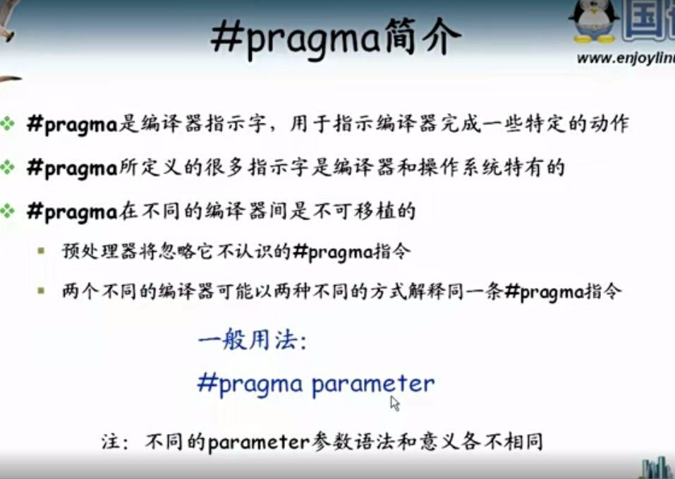
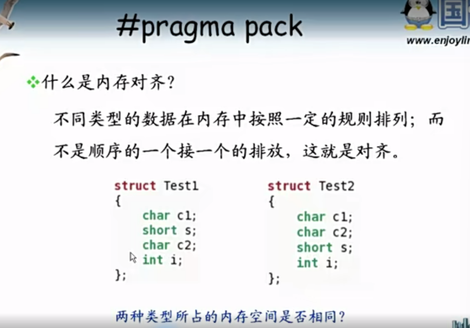
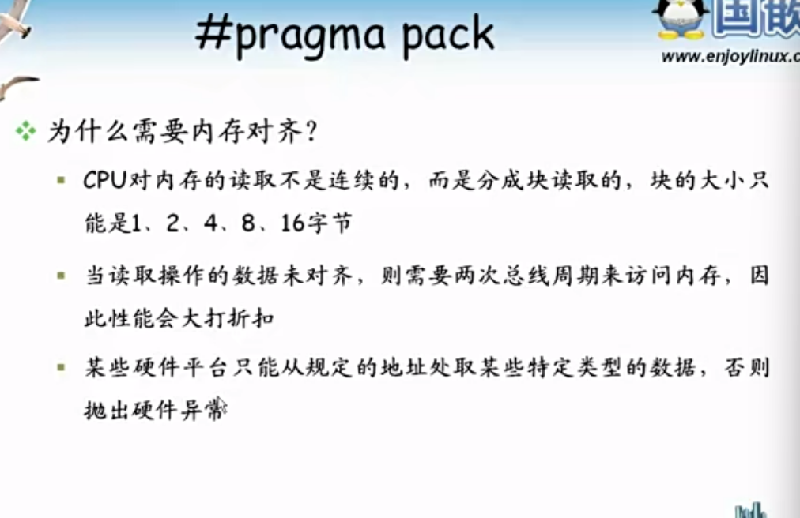
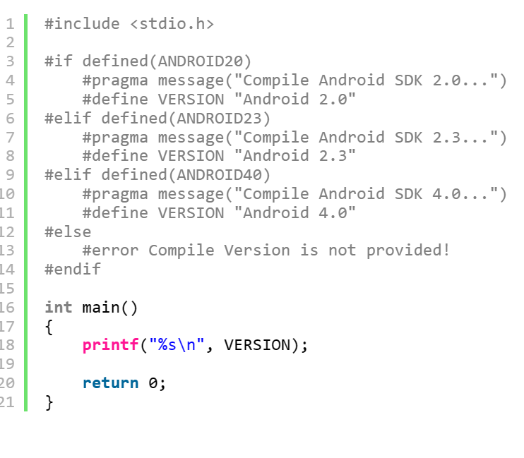

### #pragma预处理分析



内存对齐







```
#include <stdio.h>
 
#pragma pack(8)
 
struct S1
{
    short a;
    long b;
};
 
struct S2
{
    char c;
    struct S1 d;
    double e;
};
 
#pragma pack()
 
int main()
{
    struct S2 s2;
     
    printf("%d\n", sizeof(struct S1));
    printf("%d\n", sizeof(struct S2));
    printf("%d\n", (int)&(s2.d) - (int)&(s2.c));
 
    return 0;
}
```

