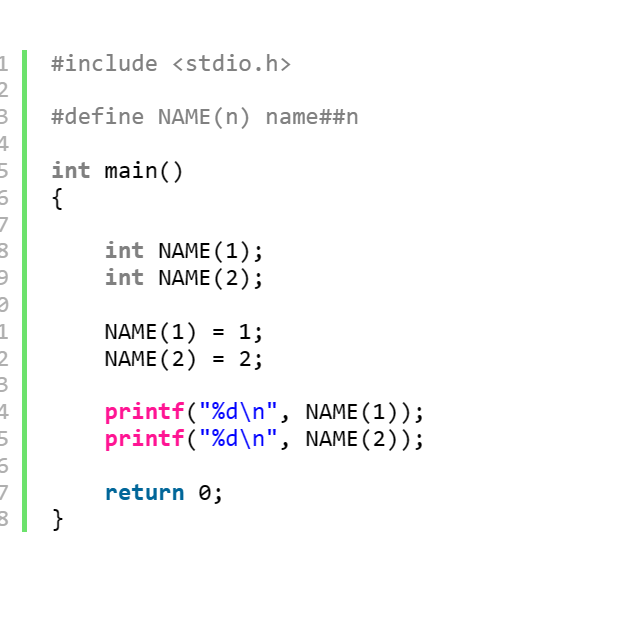
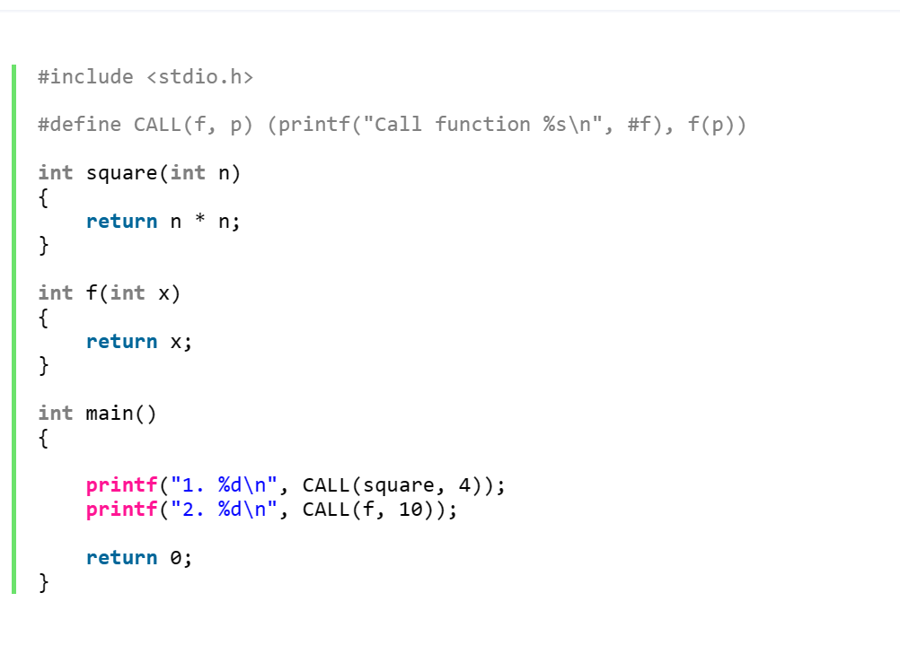
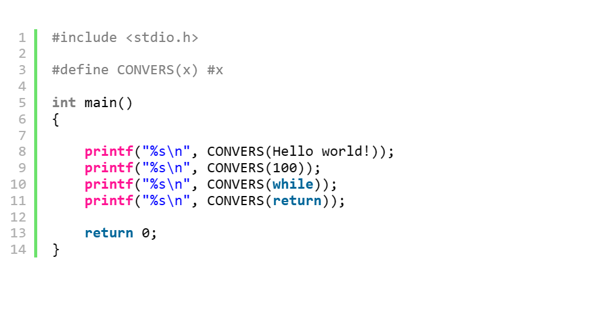

### #与##运算符使用分析

##### #运算符

1、#预算符用于在预编译期将宏参数转换为字符串

#define MESSAGE(X)    #X







2、##预算符用于在编译期粘连两个符号

#define NAME(n)    name##n

```
#include <stdio.h>
 
#define STRUCT(type) typedef struct _tag_##type type;\
struct _tag_##type
 
STRUCT(Student)
{
    char* name;
    int id;
};
 
int main()
{
     
    Student s1;
    Student s2;
     
    s1.name = "s1";
    s1.id = 0;
     
    s2.name = "s2";
    s2.id = 1;
     
    printf("%s\n", s1.name);
    printf("%d\n", s1.id);
    printf("%s\n", s2.name);
    printf("%d\n", s2.id);
 
    return 0;
}
```

