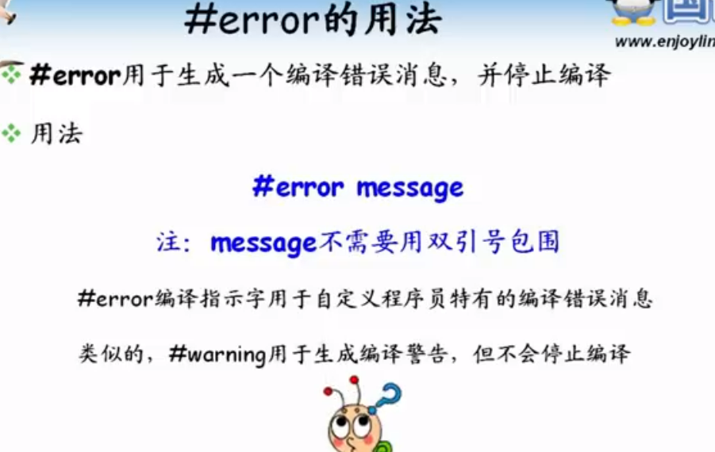
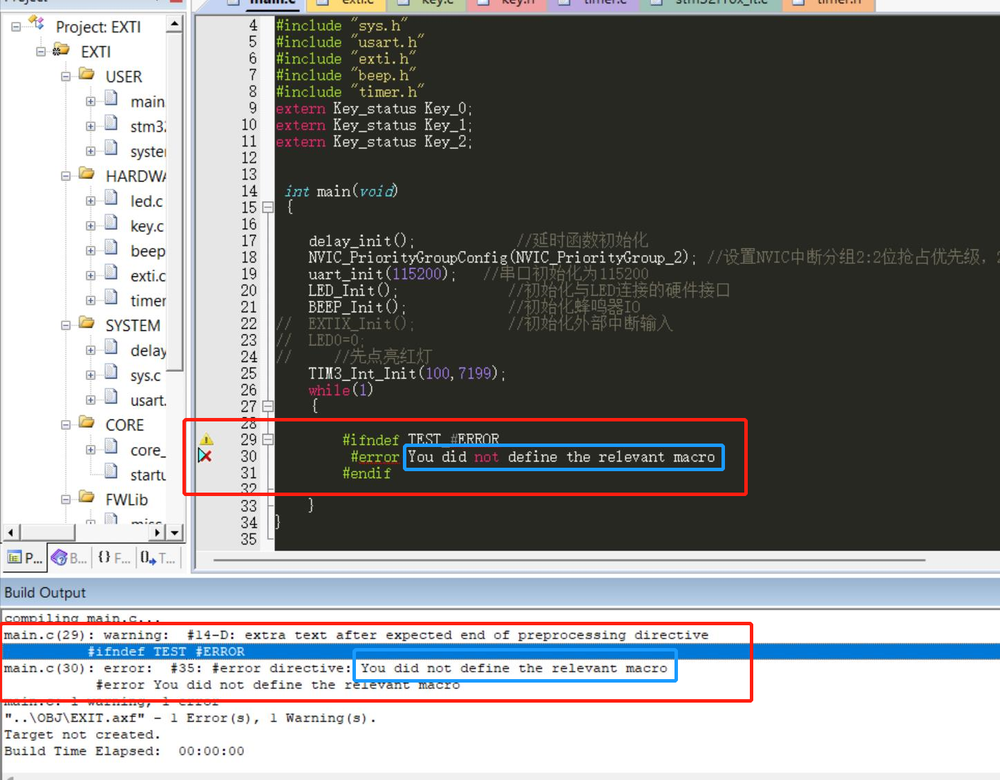

### C语言#error和#line

##### #error

#error用于生成一个编译错误消息，并停止编译

示例：

随便找了一个工程测试下#error

看图中我圈起来的部分，编译器提示warning和error。看我的程序如果没有定义TEST_#ERROR这个宏，编译器会报错You did not define the relevant macro

#line

#line用于强制指定新的行号和编译文件名，并对源程序代码重新编号

