### 标识符

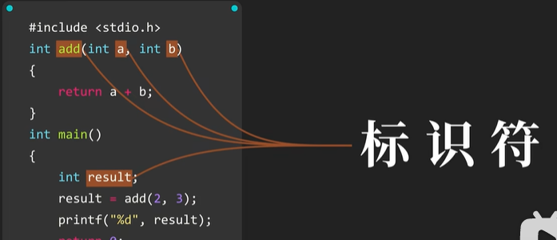

标识符必须声明定义，可以是变量、函数或其他实体。

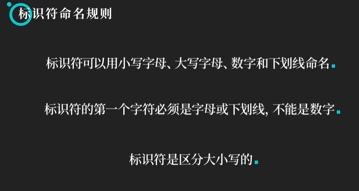

Int是标识符吗？

不是，int是c语言关键词，不是随意命名的


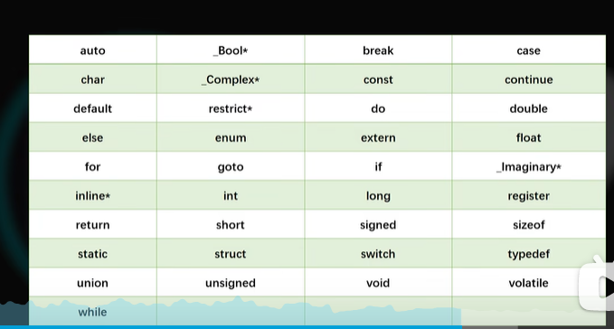

#### 常量

不需要被声明，不能赋值更改。

#### printf函数

printf是由print打印和format格式，占位符打印

定义写在<stdio.h>当中。

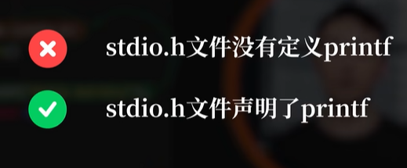

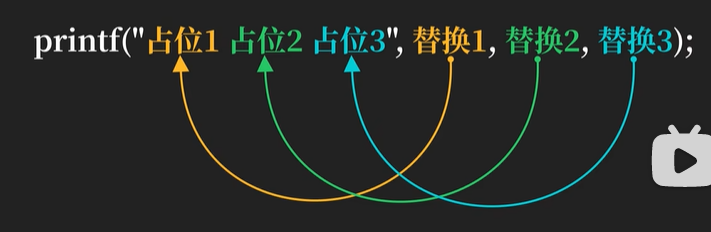

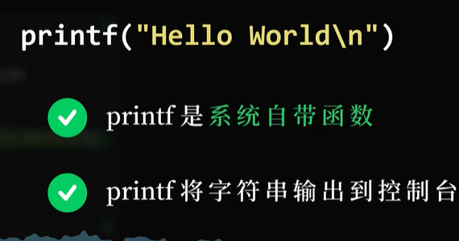

#### 整数数据类型

定义不同整型原因：占用内存大小不一样，表示数据范围不一样。

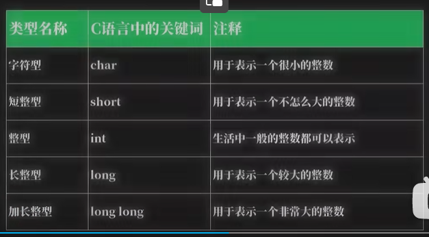


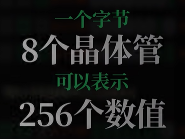

char、short、int、long、longlong占用字节和数值范围：

c语言并未规定数据类型的大小范围，具体实现交由编译器和平台决定

#### sizeof（测量实体占用字节大小）

占用字节越大可表示范围越大。

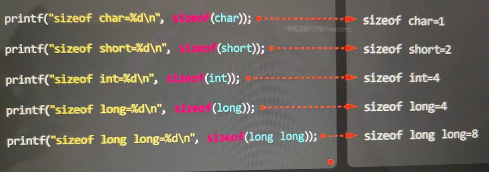

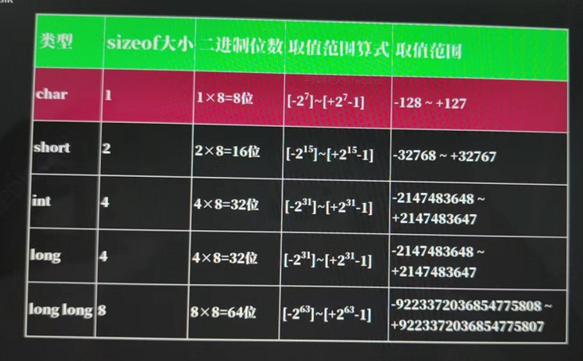

不要最高位作为符号位 unsigned。

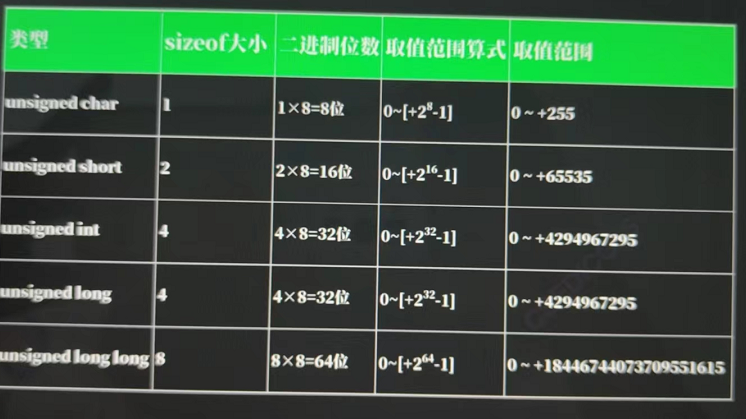

1~5以看完。浮点类型

#### 浮点类型float

%d占位符用于整型，%f占位符用于浮点型。

float至少能表示6位有效数字。

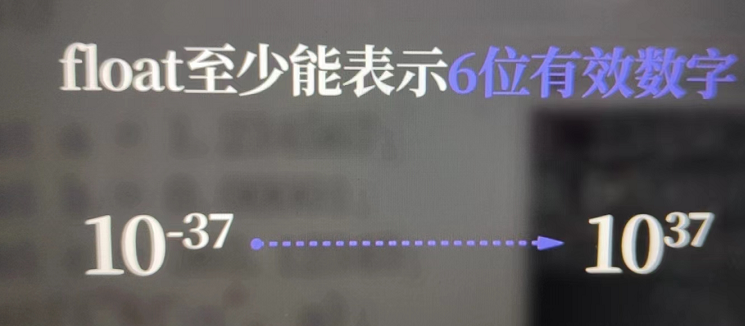

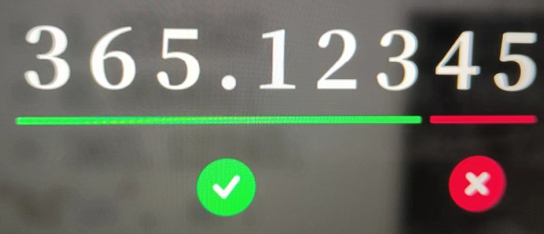

#### 浮点类型double

比float精度更高的类型，双精度浮点型double。

#### 浮点类型所占字节

浮点类型，精度越高，范围越大，所占字节越大。

float  4；double 8字节。

#### 变量常量

变量：可以改变并且有可能变化的。

常量：没有变化且不能变化的。

声明变量：

标识符：由自己命名的标志，表示变量、函数或其他实体的名称。

标识符命名规则：1、只能由大小写英文字母、数字或下划线组成。

2、标识符不能以数字开头。

3、标识符不能是已有关键字。

关键词：C语言标准规定，有特殊意义和用途，可以直接在程序中被使用。比如：short、int、long 、float、double。

声明变量公式：【数据类型+标识符名+分号】。先声明在使用！！！

##### 变量初始化和赋值方法：

1、变量声明后，立即初始化。

```
int a=100;
printf("%d\n",a);
```


2、变量先声明在变量赋值。

```
int a;
a=100;
printf("%d\n",a);
```

注：变量可以多次赋值，但不能多次初始化。

##### 常量

字面常量无需声明，编译器可判断类型。

符号常量： 

```
#define 符号常量  值
```

#### 字符类型变量与常量

字符常量是由单引号包括的。

```
例如： 'a'
```

占位符

```
整数类型 %d
浮点类型 %f
字符类型 %c
```

字符类型占用空间：

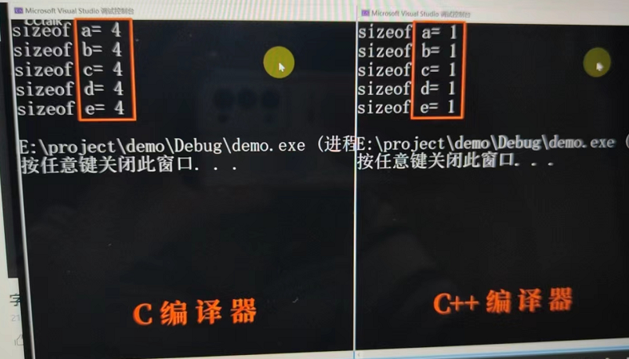


字符变量：char

字符和数值存在一一对应的映射关系，被称为美国信息交换标准代码即ASCII码。

字符类型仅需要一个字节可以正常存储。

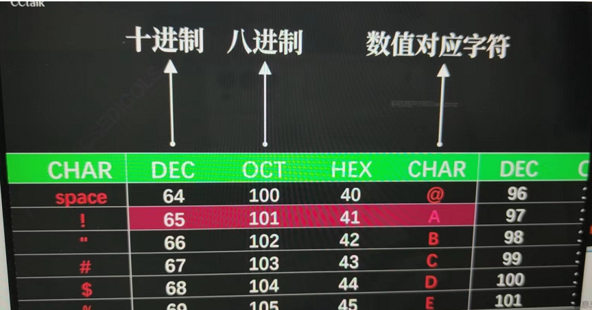

```
字符类型就是整型类型
字符类型只占用一个字节
字符类型命名为char
```

```
\n为换行符，\n表示结束一行打印，并从下一行开始打印。
```

例题：

定义一个字符变量letter，将其初始化为大写字母A。通过ASCII中的关系，将大写字母A，变成小写字母A，并将小写字母A打印出来。

```
#include <stdio.h>
int main ()
{
char letter ='A';
letter =letter+32;
printf("letter =%c",letter);
return 0;
}
```

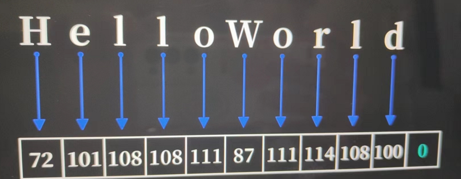

数值0：用于标识字符串结束。

转义字符：\

```
\数值（八进制）：转义字符
printf("hello\0world");
打印hello
printf("\110\145\154\154\157");
也是打印hello
printf("hello\12world");
打印hello
world
效果等同于\n
```


#### printf

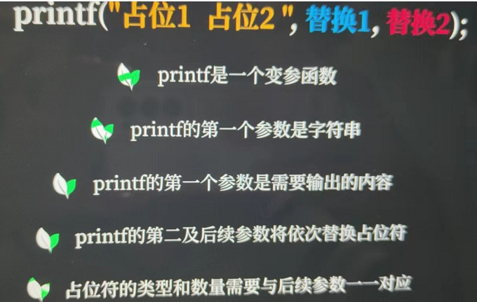

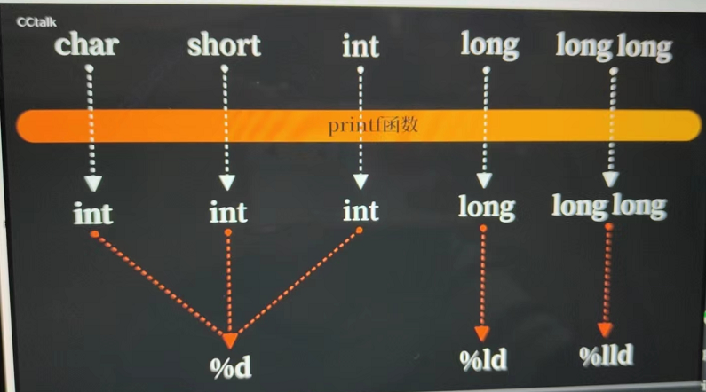

无符号整型占位符：%u

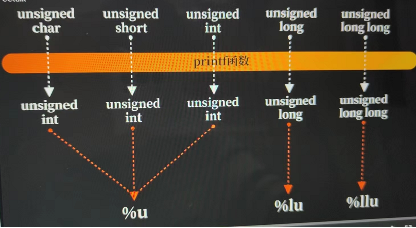


#### 精度

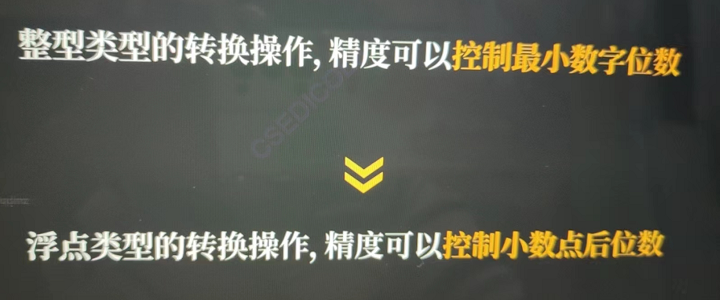

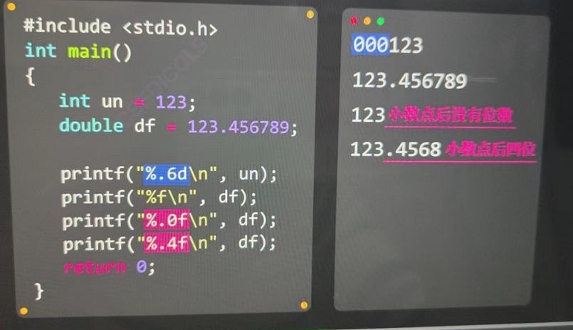

#### 最小字段宽度

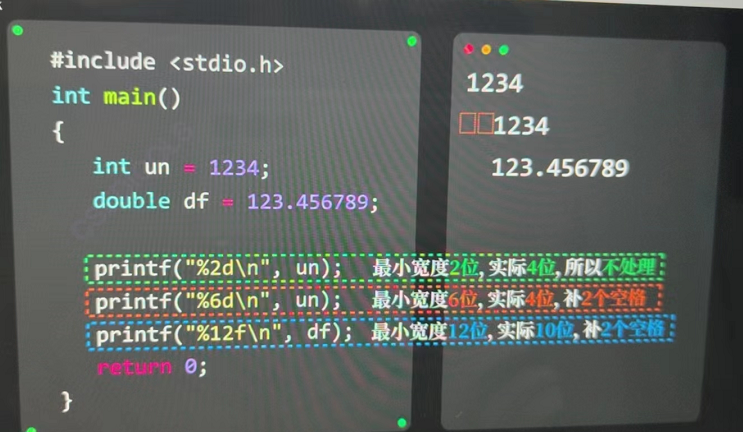

```
使用最小字段宽度
如果指定标志0，则会用0来补齐最小宽度。
```

6~10

#### scanf(用于输入)

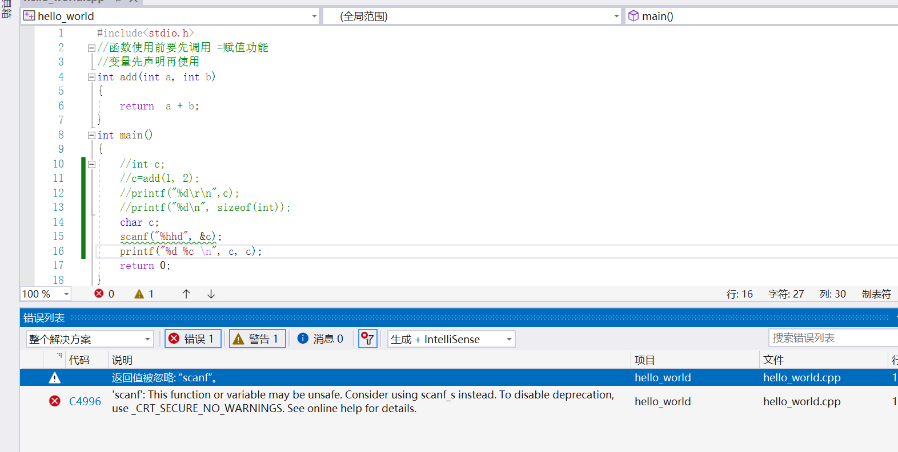

```
_CRT_SECURE_NO_WARNINGS
```

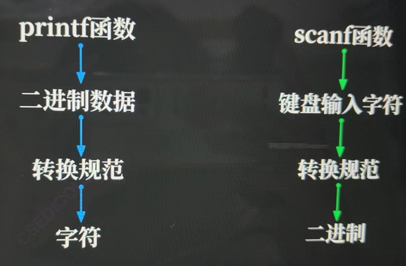

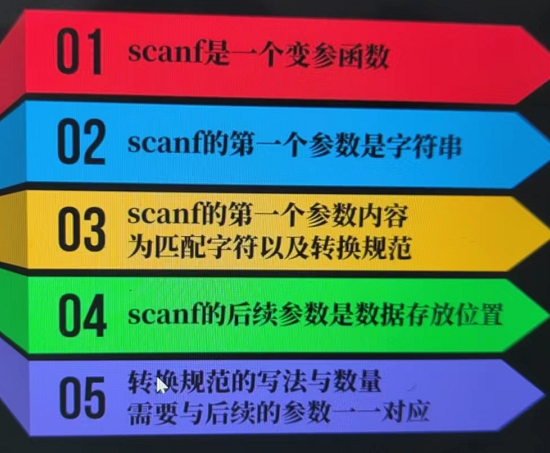

scanf将输入的字符串按照对应的转换规范进行转换。

转换完成后的二进制，将依次存放到后续参数的变量地址中。

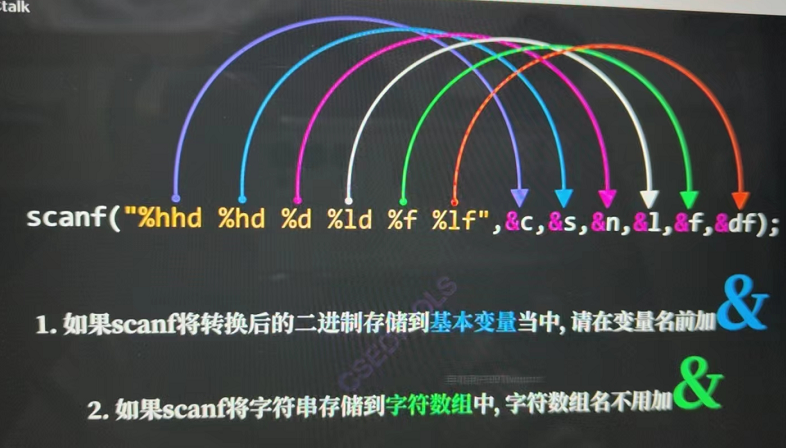

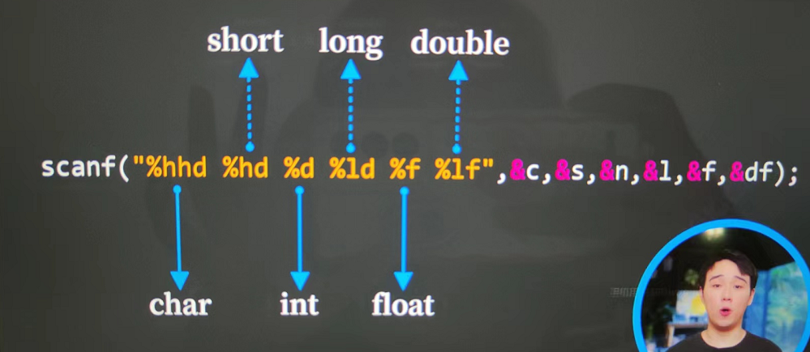

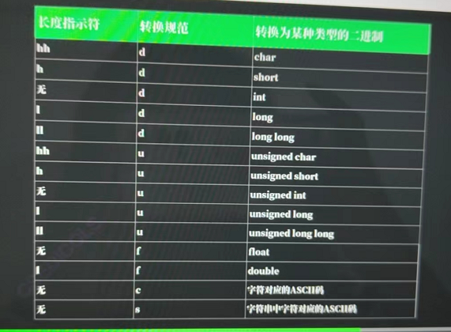

```
输入字符串
#include <stdio.h>
int  main()
{
char str[10];
scanf("%s",str);
printf("%s",str);
return 0;
}
```

```
输入字符
#include <stdio.h>
int main()
{
char c;
scanf("%c",&c);
printf("%d  %c\n",c,c);
return 0;
}
```

#### 运算符12

# 指针

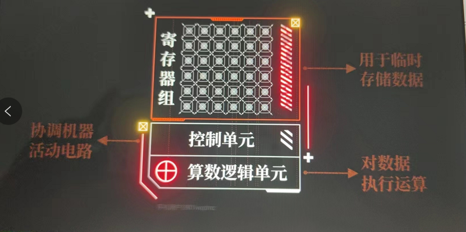

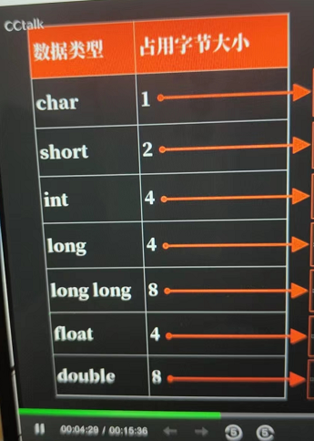

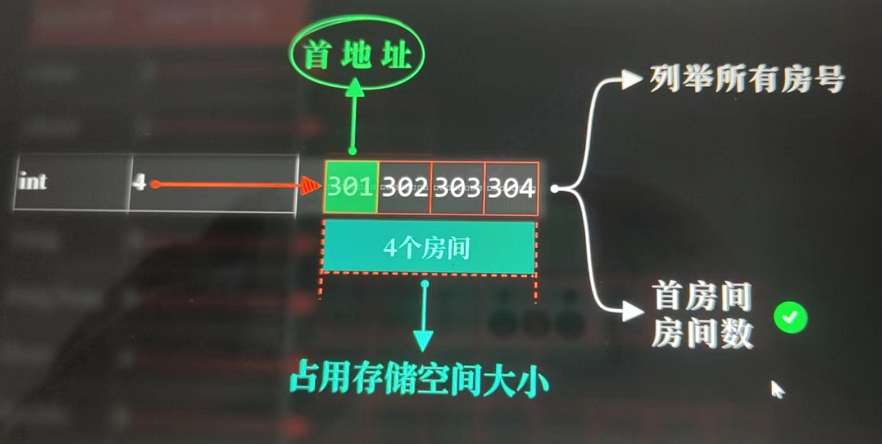

#### 取地址运算符&

```
&数据对象
获取数据对象首地址和所需储存空间大小
```

#### 指针类型

```
目标数据类型 * 变量名    声明指针
```

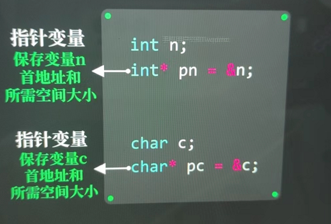

指针类型的值是目标数据对象首地址。

数据对象的空间大小存储在哪？

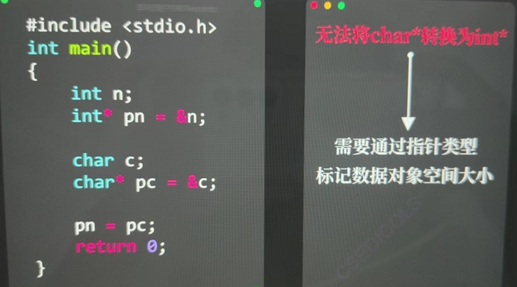

```
首地址可以复制，指针类型改变，导致数据长度改变，因此无法正确复制。
```

```
指针类型是通过值来保存目标数据对象的首地址，通过类型本身来标记目标数据对象的空间大小。
```

#### 取值运算符  *

```
*指针
根据指针中存储的首地址和空间大小找到目标数据对象。
```

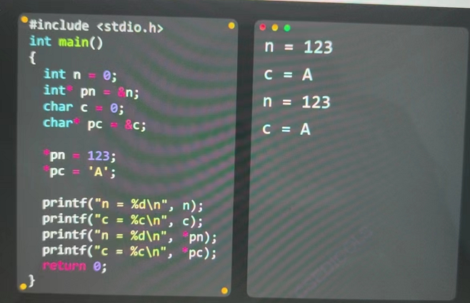

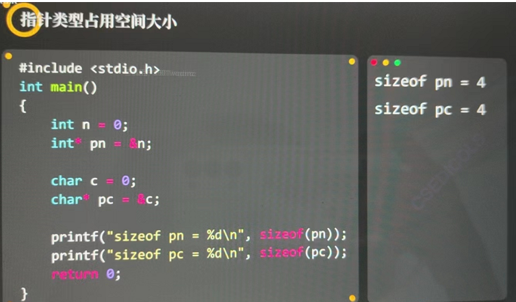

```
指针所占用的字节大小，还和编译器或者编译配置有关。
```

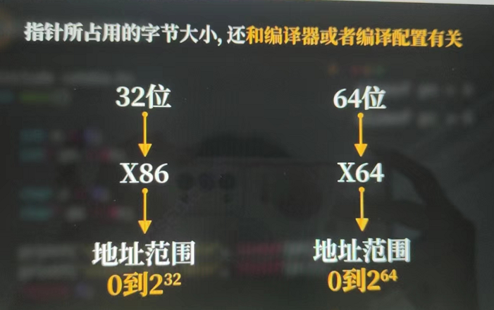

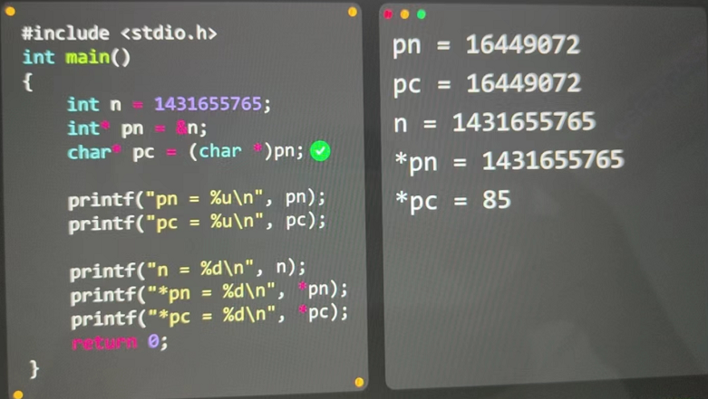

### 指针访问数组

第一个元素获取数组首地址。

取值运算符的优先级高于算术运算符。

数组名获取数组首地址。

###### 数组名出现在表达式中，数组名将会转化为指向数组第一个元素的指针。

```
比如：arr+1等同于&arr[0]+1
例外：1、对数组名使用sizeof时
     2、对数组名使用取地址运算符&时
```

下标运算符最终会展开为指针的形式。

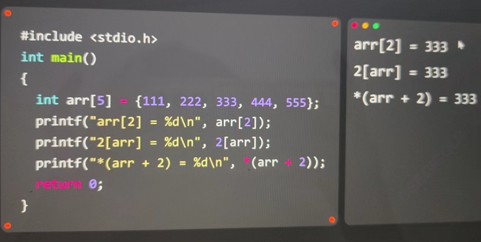

##### 指针作为参数进行传递

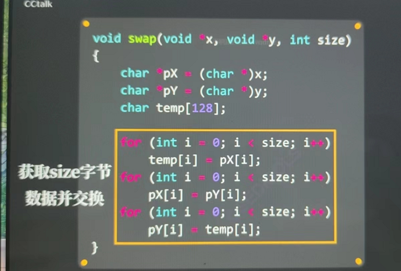

#### 指针的指针（多级指针）

```
int  *数据对象的指针被称为【二级指针】
```

#### 多维数组

```
指针数组  int*  pB[10]
数组指针  目标类型 （*变量名)[元素个数]
```

数组指针的移动和取值

35

#### 字符串处理函数

```
#include "string.h"
```

strlen：获取字符数组中字符串 的长度

strcat：字符串拼接函数，将源字符串拼接到目标字符串后面

strcpy：字符串复制函数，将源字符串复制到目标字符串中

strcmp：字符串比较函数，，比较两个字符串，一致返回0   ，不同1、-1

37

#### 指针实现字符串处理函数

```
#include <stdio.h>
size_t  mstrlen(const  char  *str)
{
if(str=NULL)
{
return 0;
}
size_t  len =0;
while(*str !='\0')
{
len++;
str++;
}
return  len;
}

int main()
{
size_t  len;
len =mstrlen(NULL);
printf("%d\n",len);

len =mstrlen("");
printf("%d\n",len);

len =mstrlen("HELLO");
printf("%d\n",len);
return 0;
}
```


```
#include "stdio.h"

char * mstrcat(char *  destination ,const char * source)
{
if(destination == NULL)
{
return NULL;
}
if(source == NULL)
{
return destination;
}
char *ret =destination;//保存字符串首地址
while (*destination !='\0')
{
destination++;
}
while(*source !='\0')
{
*destination =*source;//把source追加到destination后面。
destination++;
source++;
}
*destination ='\0';
return ret;
}
```


```
int mstrcmp(const char *str1,const char *str2)
{
if(str1==NULL && str2 == NULL)
{
return 0;
}
if(str1 !=NULL && str2 ==NULL)
{
return 1;
}
if(str1 == NULL && str2!==NULL)
{
return -1;
}
int  ret =0;
while (1)
{
if(*str1 !=*str2)
{
if(*str1 > *str2)
{
   ret = 1;
}
else
{
ret =-1;
}
break;
}
else
{
if(*str1 == '\0' &&  *str2 == '\0')
{
break;
}
str1++;
str2++;
}
}
return ret;
}
```

### 初识结构化数据

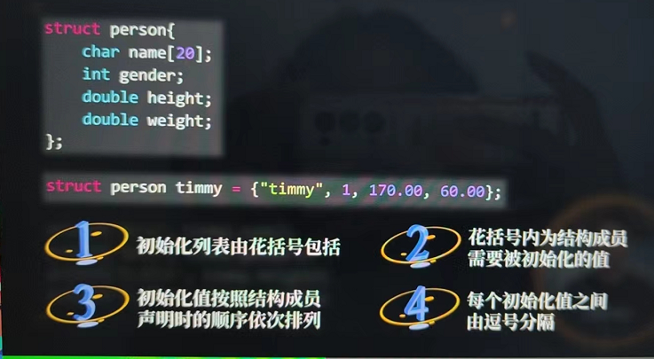

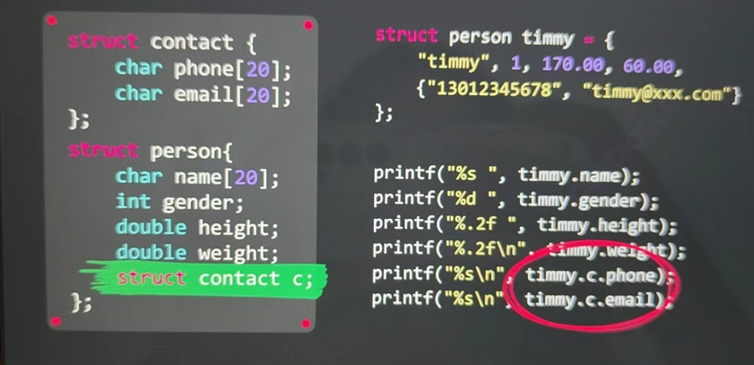

##### 指向结构的指针

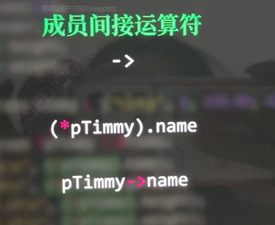

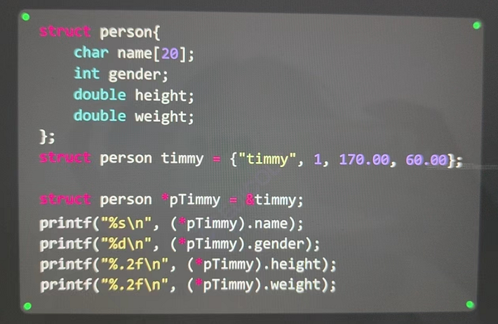

##### 联合 union

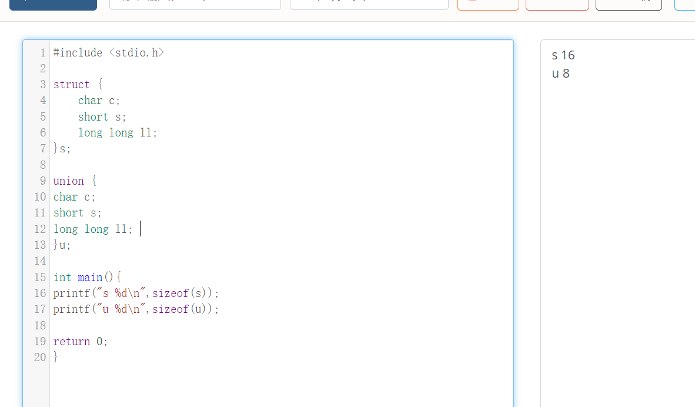

##### 结构体与联合体

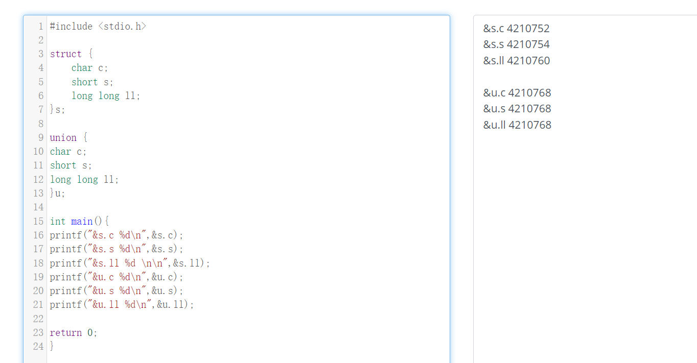

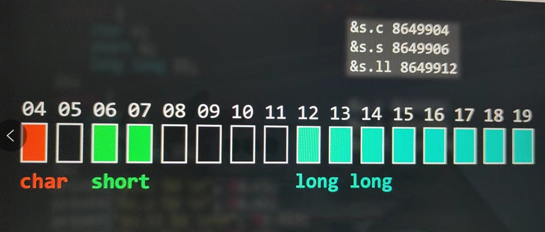

内存对齐！

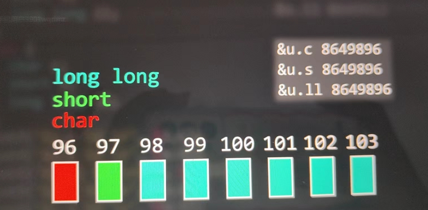

联合共用。

##### 枚举enum

枚举会从0开始，依次递增。

```
若想从1开始递增
enum msgType{
eInteger=1;
eFloat,
eString
};
```

##### 标识符的作用域

内层作用域将覆盖外层作用域。

##### 预处理指令

```
取消宏定义
#define NUM 1
#undef NUM
#define NUM  3
```

##### typedef关键词

定义数据类型别名

经常用于结构

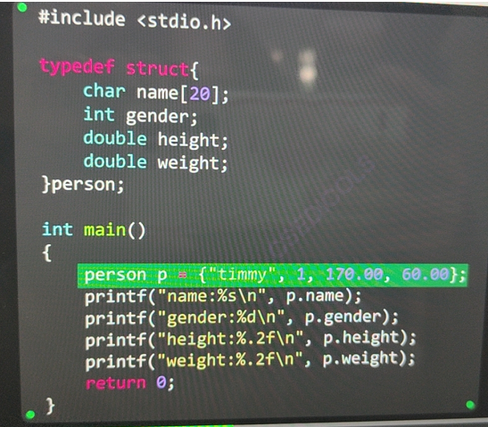

```
typedef没有创建任何新类型，只是为某个已存在的类型增加了一个方便的别名
```

typedef与#define的区别

```
#define可以为值设置一个别名，而typedef不行
例如：  #define  PI  3.1415926
#define由预编译器处理，并且修改替换代码，typedef不受预处理影响，在编译时由编译器处理
#define也能为类型定义别名，但某些情况下，使用typedef更合适
例如：   typedef  char  *STRING
        STRING   name1,name2;
        
```

整型类型的别名无需自己定义，编译器会根据平台的整型范围大小，设置对应的别名。头文件：stdint.h

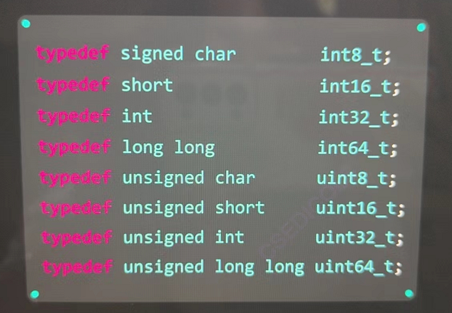

printf的转换规范如何保证可移植性？

```
头文件 inttype.h

```

##### 预处理中的分支结构

```
#if  常量表达式
在编译前，由处理器处理，根据分支走向，保留需要走向分支的代码，删除被跳过分支的代码。
#if
#else
#elif

#ifdef
#ifndef
```

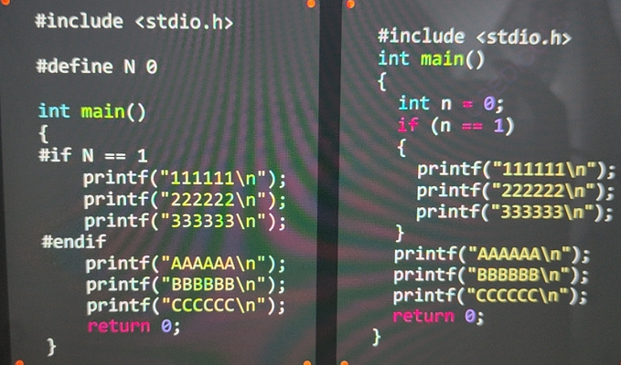

##### #ifdef    #ifndef

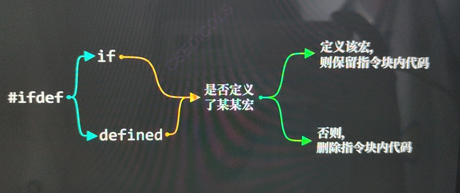

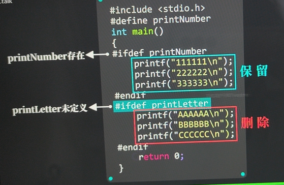

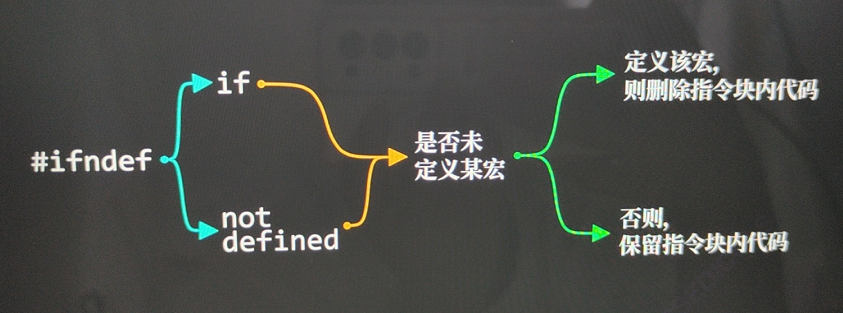

还可以使用#if  defined（宏）或 #elif   defined（宏）

#### #include

```
#include <文件夹>
在编译器的包含目录中搜索文件，< >编译器自带文件，在编译器的包含目录中

#include "文件名"
先在当前目录中搜索文件，再到编译器的包含目录中搜索文件
```

#### 多文件代码

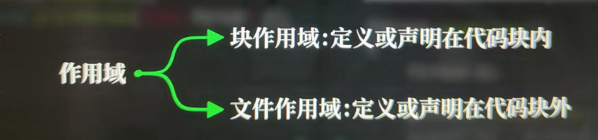

#### 存储类别

声明在代码块内的任何变量，都属于自动存储类别的变量。

```
指明一个变量属于自动存储类别  auto
```

n的生命期----数据对象从创建到销毁之间。数据对象存在的周期。

n的作用域----标识符对数据对象指代关系存在的区域，它是一种关联关系。

自动变量拥有块内作用域及生命期。---局部变量

#### 文件操作

fopen 


