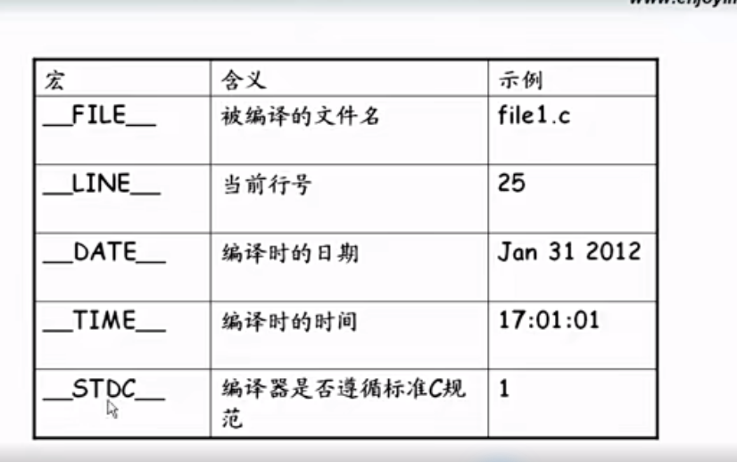

### 宏定义与使用分析

宏可以定义常量，也可以定义表达式。

##### 宏定义常量：

#define定义宏常量可以出现在代码的任何地方。

#define从本行开始，之后的代码都可以使用这个宏常量。

```
举例：
int 2num_min(int a,int b)
{
#define MIN(a,b) ((a)<(b)?a:b)
return MIN(a,b);
}
int 3num_min(int a,int b,int c)
{
return MIN(MIN(a,b),c);
}
int main ()
{
 2num_min(5,6);
 3num_min(5,7,9);

}
这样写代码是可以正常运行的，在某个函数里定义的宏，可以在之后的函数中使用。
```

##### 宏定义表达式

#define表达式有函数调用的假象，不是函数；

#define表达式比函数更强大；

#define表达式比函数更容易出错。



