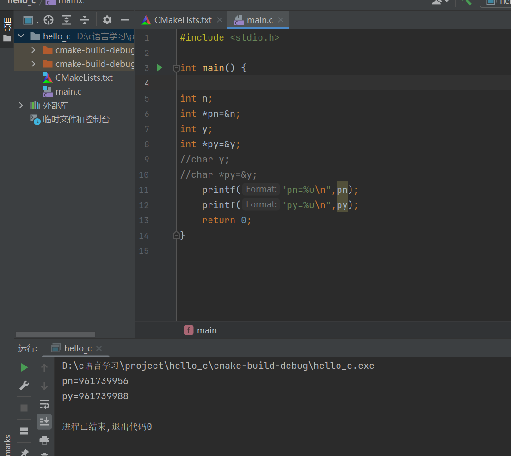
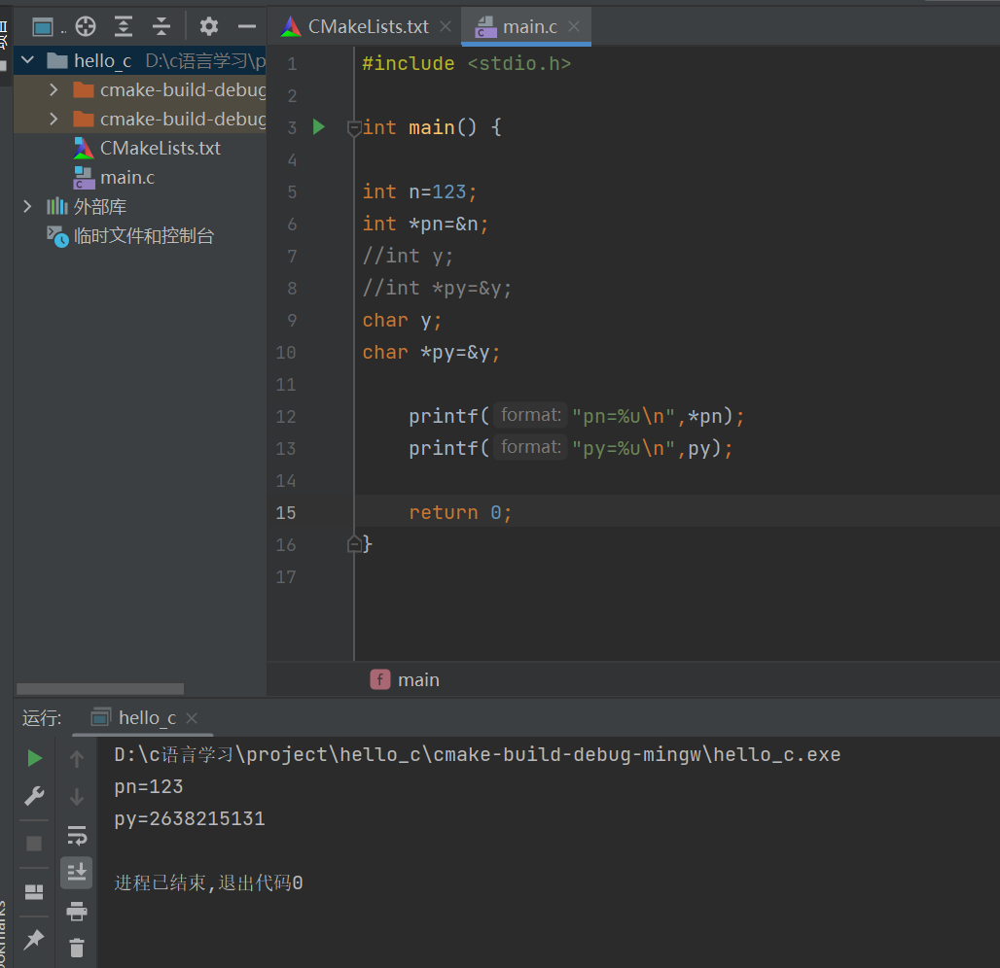
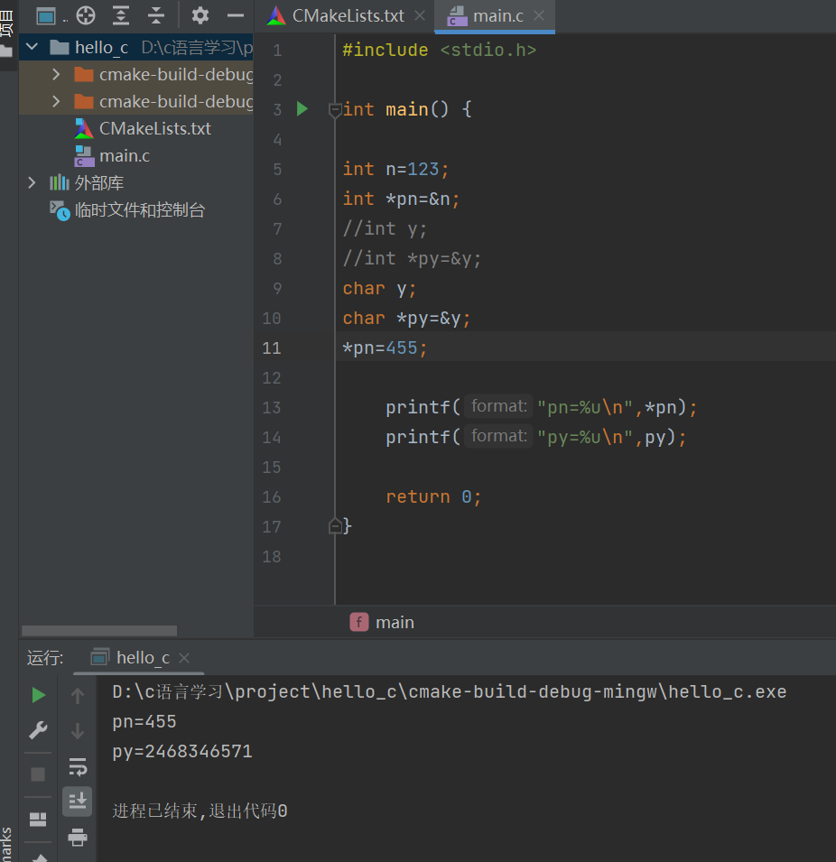
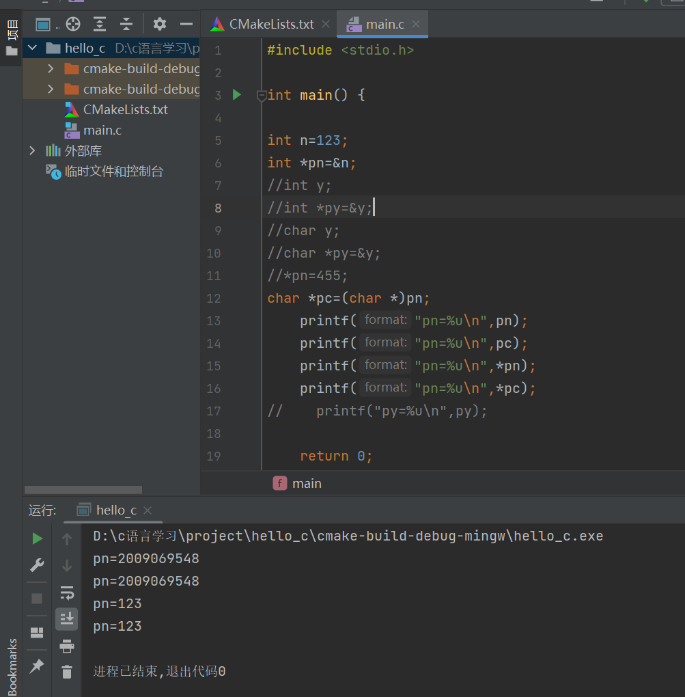
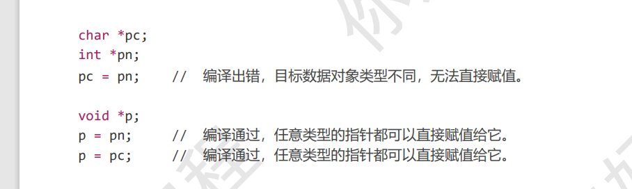

# 指针

### 前言

记录一个数据对象在内存中的存储位置，需要两个信息：

​                                    1、数据对象的首地址。

​                                     2、数据对象占用存储空间大小

基础数据类型所占内存空间大小（字节），一个字节代表8个二进制位

​                       char                 1

​                       short                2

​                       int                     4

​                       long                  4 

​                        longlong           8

​                        float                   4

​                        double               8

### 指针数据类型

#### 取地址运算符&

可以获取数据对象的首地址和所需存储空间大小

#### 声明指针类型

```
int  n;
int* pn=&n;
```

                   



指针类型的值是目标数据对象的首地址！

C语言中通过不同的指针类型来标记目标数据对象的空间大小，那么不同数据类型能否相互赋值呢？

比如：

```
#include <stdio.h>

int main() {
int n;
int *pn=&n;
char y;
char *py=&y;

    pn=py;
    
    printf("pn=%u\n",pn);
    printf("py=%u\n",py);

    return 0;
}

```

由于char和int 类型所占空间大小不一样，不能进行自动转换。

#### 取值运算符*

根据指针存储的首地址和空间大小找到目标数据对象。

注意：%p是指针类型专用站位符，在32以及64位编译条件下都能保证打印正确。



也可以这样使用指针修改所指数据对象，以及访问数据对象



#### 指针类型大小

```
注意：char和int存储的是数据范围不同的两种数据，char型占用空间小一点，int占用空间大一点。  
char*和int*存储均为数据对象的地址，它们所占的空间是相同的。
```

#### 强制转化指针类型

int型指针和char型指针不能使用赋值自动转化，如果使用强制转化。

我们可以看到下面程序，强制将pn转化为char *赋值给pc，再看运行结果，两个首地址、值一致。



### 指针运算

#### 指针类型地址加减规律

指针类型加n后，首地址向后移动n*步长字节。

指针类型减n后，首地址向前移动n*步长字节。

注意：取值运算符*的优先级高于算术运算符。

### 数组

#### 访问数组方法

1、数组名【下标】

2、 *(数组名+偏移量)     其中偏移量表示相差元素个数

#### 指针作为参数传递

#### 仅有首地址的指针类型void *

类型为void *的指针仅保存首地址，不保存目标数据对象的空间大小。

void *好处：任意类型的指针都可以直接赋值给它。



