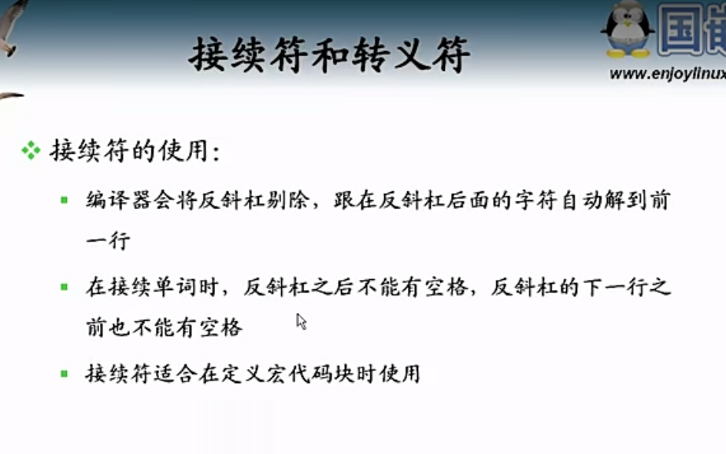
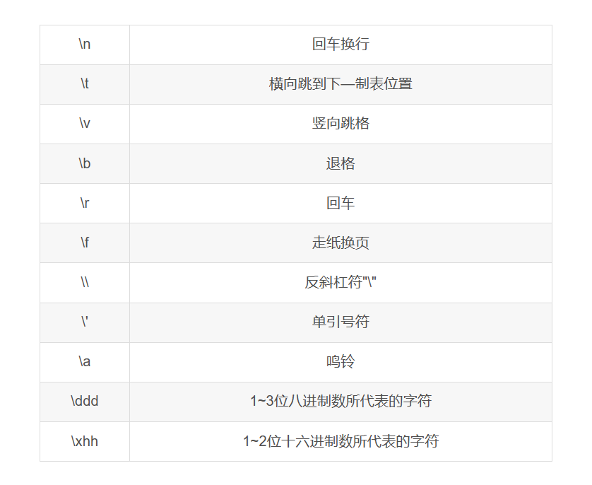

### 接续符和转义符---------   \

C语言中的\符号可以表示接续符和转义符。

C语言中的接续符( \ )放在一行代码的结尾，可以将下一行的内容提到这一行来。

\符号还有另一个作用 — 转义符。
C语言中的转义符()主要用于表示**无回显字符**，也可用于表示常规字符。

- C语言中的反斜杠（\）同时具有接续符和转义符的作用。
- 当反斜杠作为接续符使用时可直接出现在程序中。
- 反斜杠作为转义符使用时需出现在字符或字符串中。