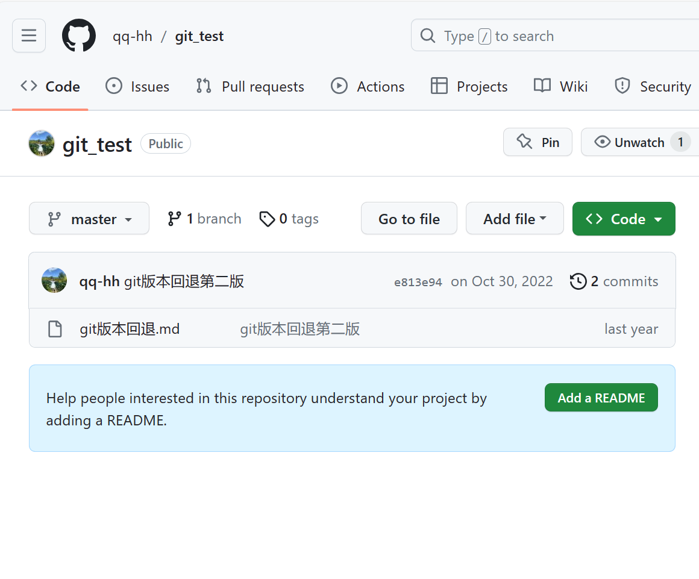
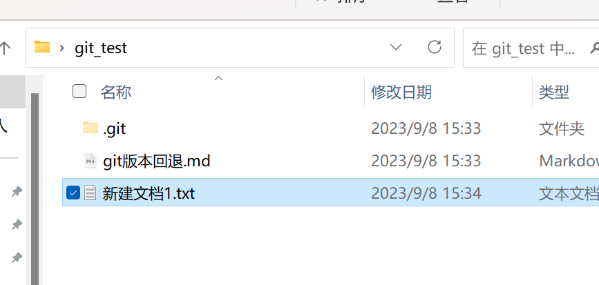
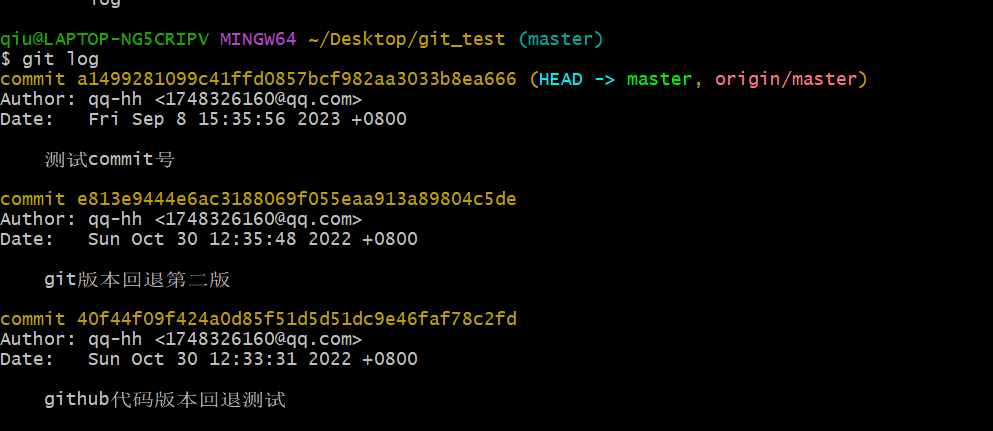

### Git在使用过程中如何回滚到指定commit号

以开源示例git_test为例，



把它下拉到我们的文件夹，并添加一个文本文件用于测试commit号，如图：



push 到我们的github，输入相关指令后，看下我们网页版的github是否更新。

如图，已经更新


此时，我们先查看下当前版本号，使用命令

```
git log 
```

显示当前版本号和之前提交过的版本号，如图：



我们可以对比下github的commit，如下：

