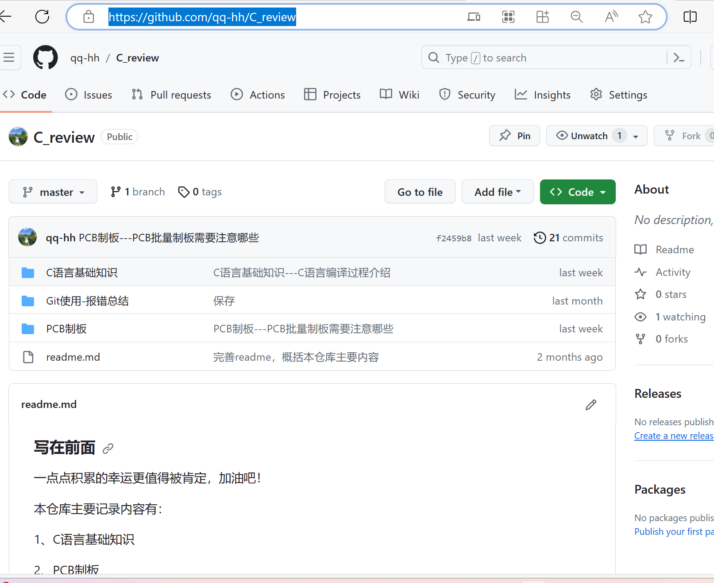

### 怎么去别人的github工程下载

##### 1、网络

确保网络能够顺利访问github，有的地方的公共网络不能访问github，我之前开过科学上网的会员，发现没必要特意开去访问它。可以直接开手机热点，一般是可以顺利访问的。

##### 2、下载

以我的github开源笔记[qq-hh/C_review (github.com)](https://github.com/qq-hh/C_review)为例。

首先，打开网址进入界面如下图：

点击code，然后下载download  zip ，就可以下载了。

注：我的笔记是用typora写的，你电脑上要有md文件的打开软件才能看。