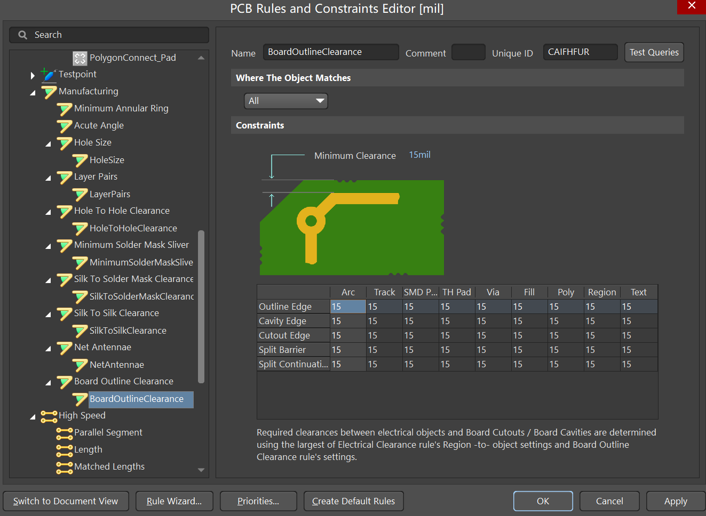
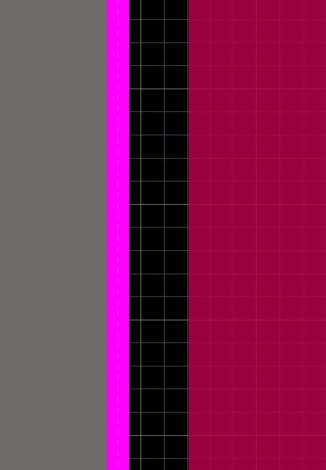
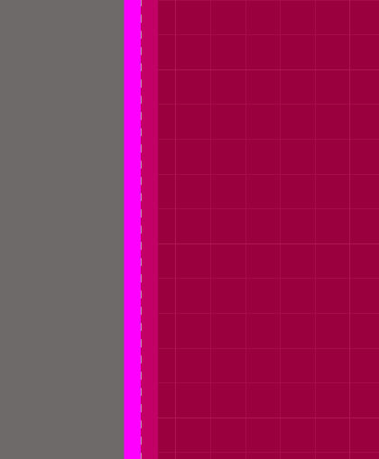

### AD设置覆铜与板子边缘间隔

1、设置板子边缘与覆铜间隔原因

在单个制板或者批量制板时，有时由于机器切割不稳定，造成切到覆铜，板子容易不稳定。为了保证机器切割不切到覆铜，我们可以设置覆铜到板子边缘的间隔。

2、设置方式

打开Design--->Rules，找到Board outline clearance这个选项，点开，新建规则。

设置适合自己板子的覆铜间隔。设置完成应用，更新覆铜。

看下效果，板子边缘与覆铜有间隔。

不设置这个间隔，看下效果如下：

