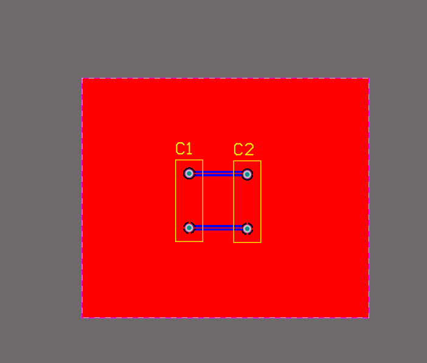
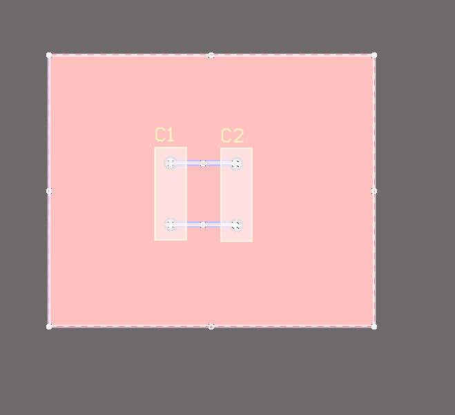
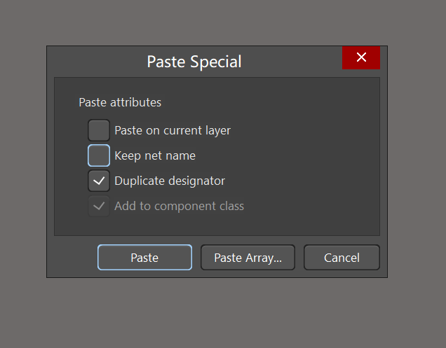
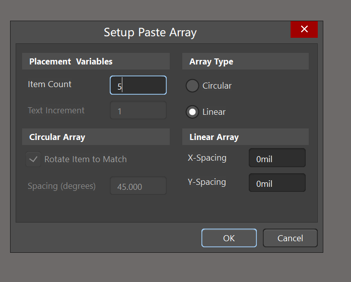
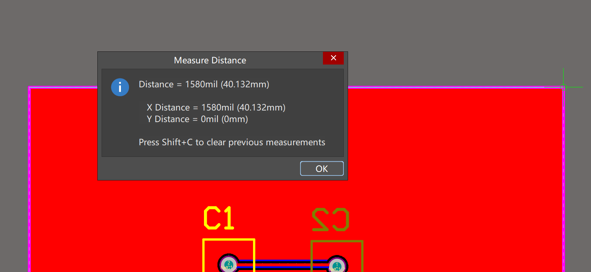
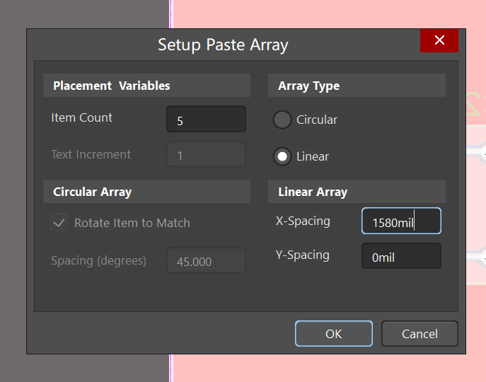
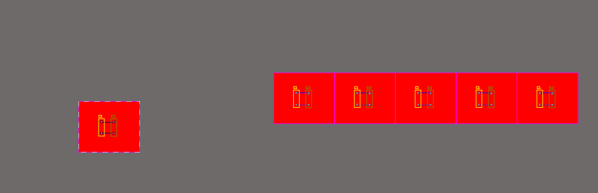

### AD拼板设置

如图，有一个需要拼板的PCB，想要在生产是拼接生产，节省材料。

操作如下：

1、全选如下，按复制Ctrl+C。

2、把输入法调整至英文，按快捷键E（先），    A（后）。

会弹出一下页面：选择Duplicate designator。

然后点击Paste Array：

如下：需要设置拼版数量和间隔

要想节约使用材料，间隔测量方法如下：

退出以上界面，回到PCB那里，测量板子所占X距离：

如土，测量间隔是1580mil，把1580填入拼板那里，如下（注意单位是mil还是mm），点击OK。

之后会让选择放置位置，最终效果如下：

拼板完成！