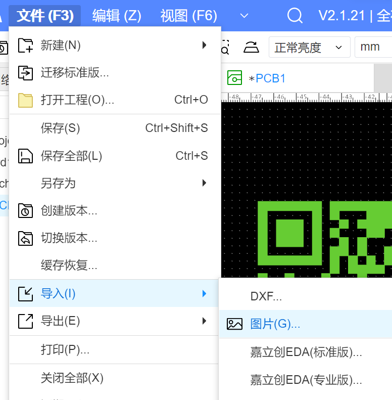
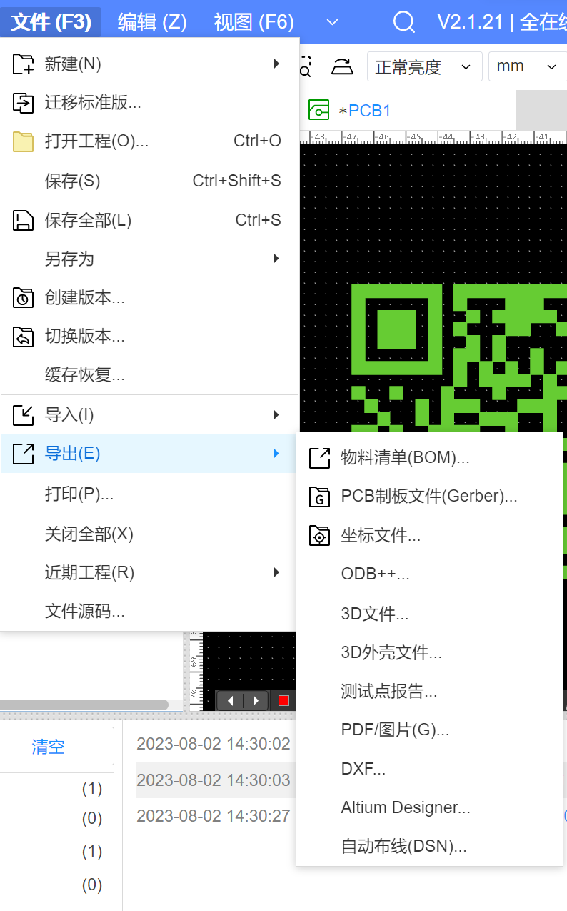
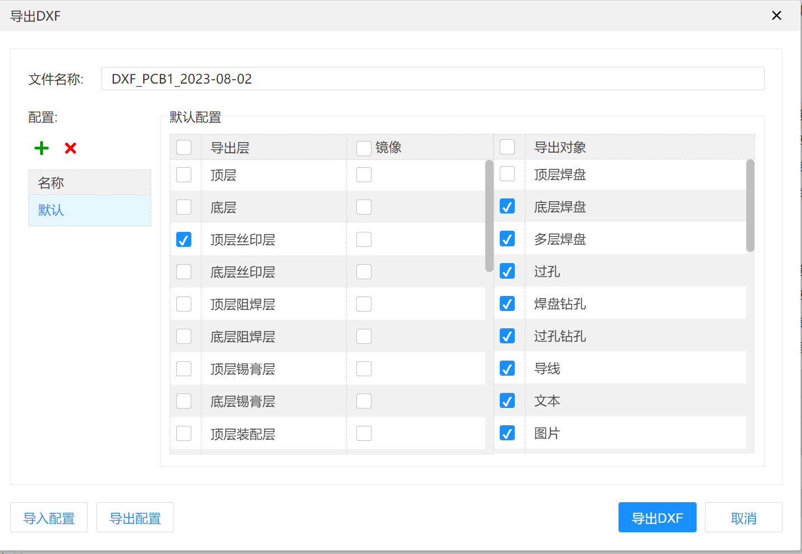
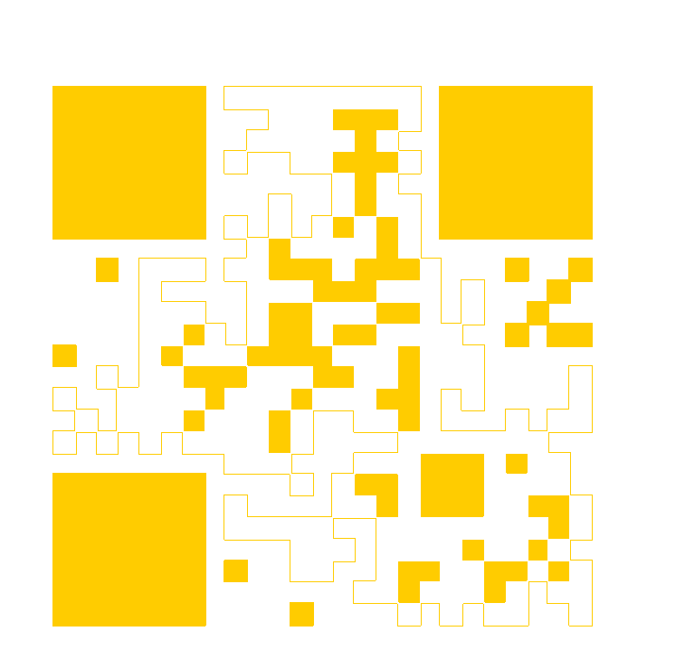
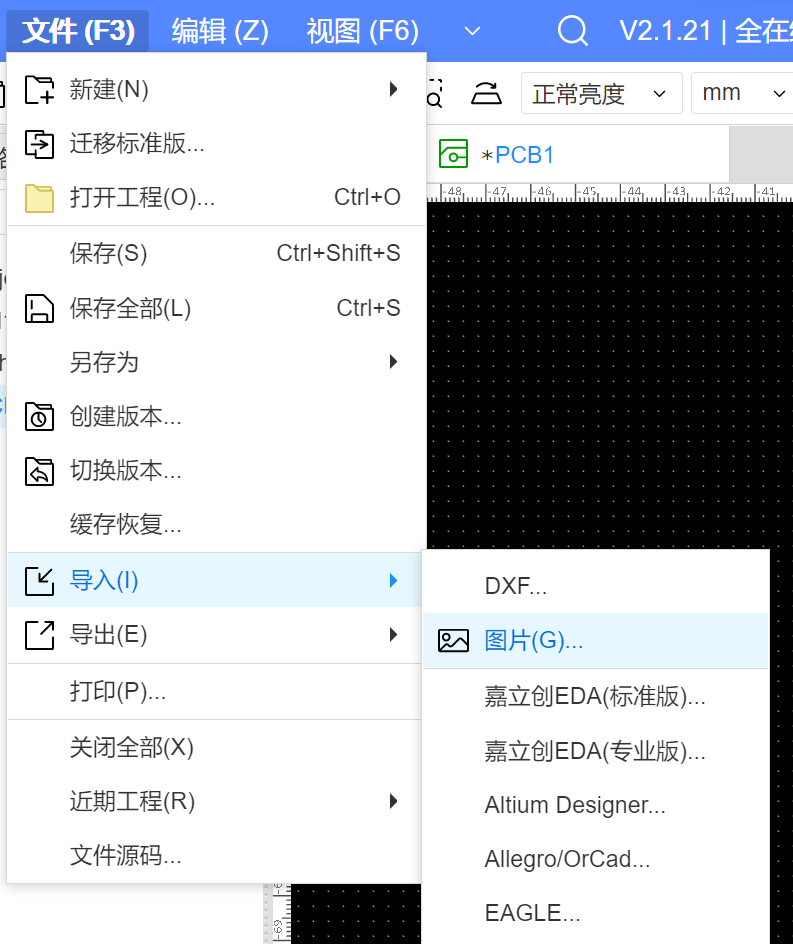
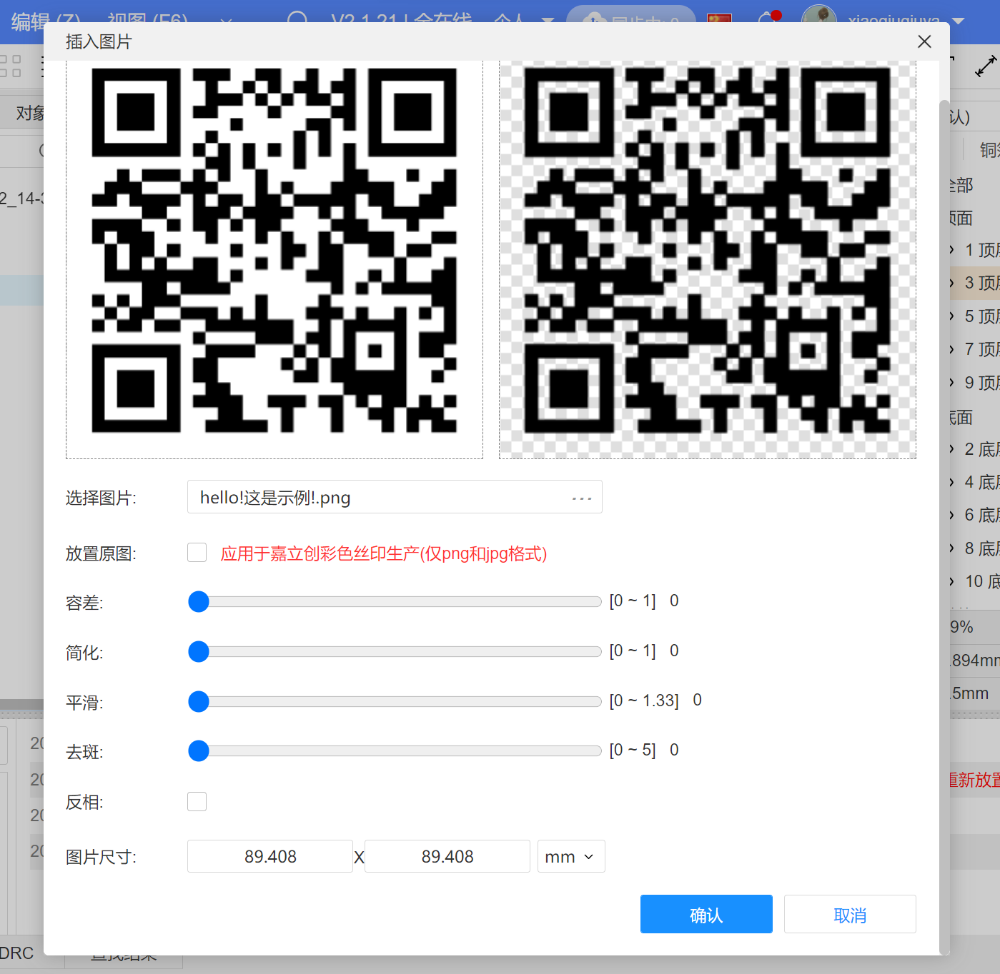
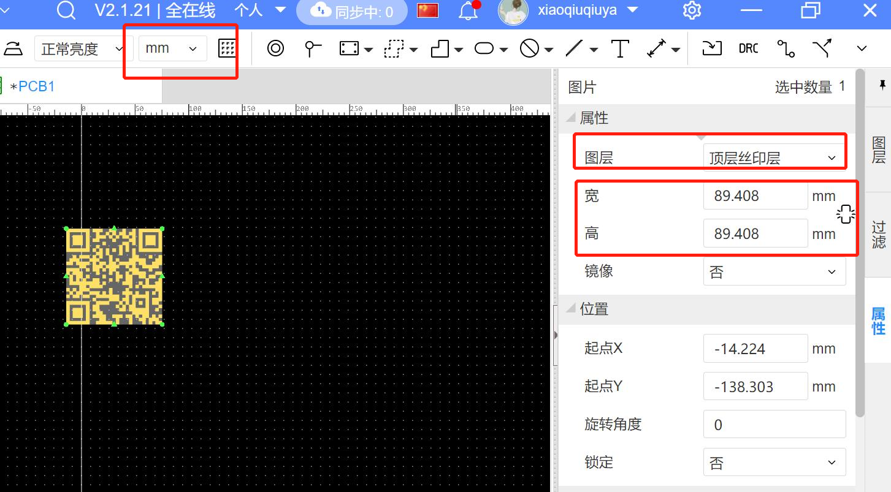
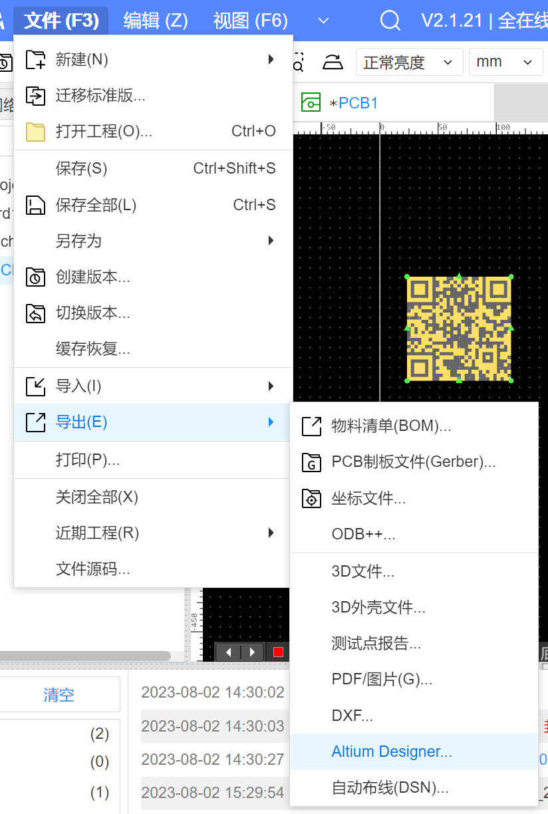
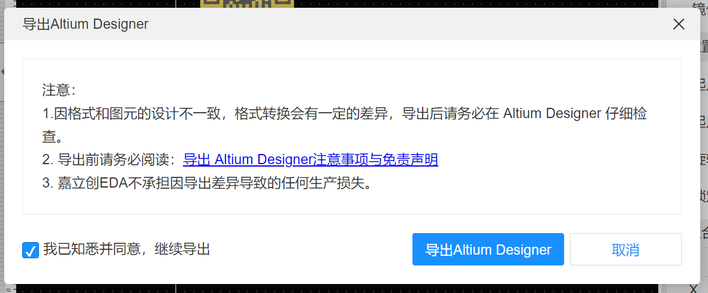
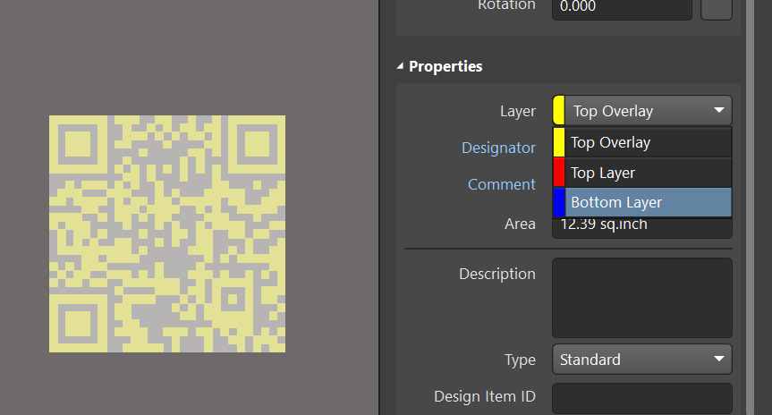

### PCB添加二维码

##### 1、PCB上添加二维码

在PCB上添加二维码，可以清楚的展示PCB板子的信息，包括：制板人员、时间以及这个板子所用的仪器。

##### 2、如何在PCB上添加二维码（错误示例）

首先说一种错误的方法，试了很多遍也不对，这个方法不可取！

###### 首先打开二维码草料生成器，网站如下：

```
https://cli.im/text
```

把PCB板子的二维码信息输入到里面，然后点击生成二维码。


下载图片，可以选择不同格式下载，这里建议选择png。


###### 下载立创EDA专业版，新建工程打开PCB

点击工程==>导入==>图片，选择对应二维码图片，然后把长度单位选择mm，二维码图层选择顶层丝印层。



###### 导出dxf

点击工程==>导入==>DXF



然后，这个界面不论你怎么选择，导出都会有错误！！！



在CAD中打开刚才导出的DXF，二维码是错误的。



之后导入AD的图中，肯定也是错误的，这个方法不可取！！！

##### 2、如何在PCB上添加二维码（正确示例）

###### 打开二维码草料生成工具，网站如下：

[草料二维码生成器 (cli.im)](https://cli.im/text)

输入你想要在PCB板子上放置的信息，如图示例：


点击生成二维码，右侧有二维码生成，在点击下载png图片。


###### 打开立创EDA专业版（必须），导入图片

打开EDA，点击工程==>导入==>图片，选择对应二维码图片，然后把长度单位选择mm，二维码图层选择顶层丝印层。



导入图片可以设置尺寸，如下：然后确认。



然后设置单位mm，和尺寸，图层设置成顶层丝印层。



然后导出AD格式，点击工程==>导出==>AD，保存（注意这是个压缩包）。



确认导出AD格式。



###### 二维码复制到PCB

解压刚才的压缩包，使用AD打开这个PCB，看到二维码，如下：


复制这个二维码到你想要的PCB中，设置这个二维码是在顶层还是顶层，都可以。



至此，完成二维码在PCB上的添加。

git config --global http.postBuffer 524288000


	gu8a_lcd_buff[10]|= 0xC0;
	gu8a_lcd_buff[11]|= 0x70;
	gu8a_lcd_buff[8]|= 0xE0;
	gu8a_lcd_buff[9]|= 0xB0;
	gu8a_lcd_buff[4]|= 0xE0;
	gu8a_lcd_buff[5]|= 0xB0;
	gu8a_lcd_buff[5]|= 0x07;
	gu8a_lcd_buff[8]|= 0x0E; 
	gu8a_lcd_buff[9]|= 0x03;
	gu8a_lcd_buff[10]|= 0x0D;
	gu8a_lcd_buff[11]|= 0x07;

