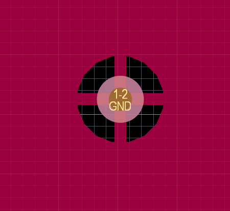
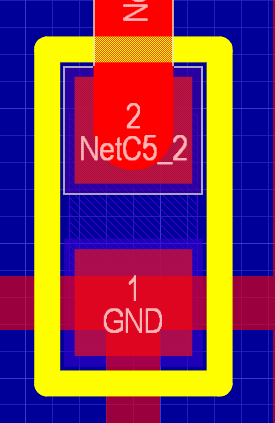
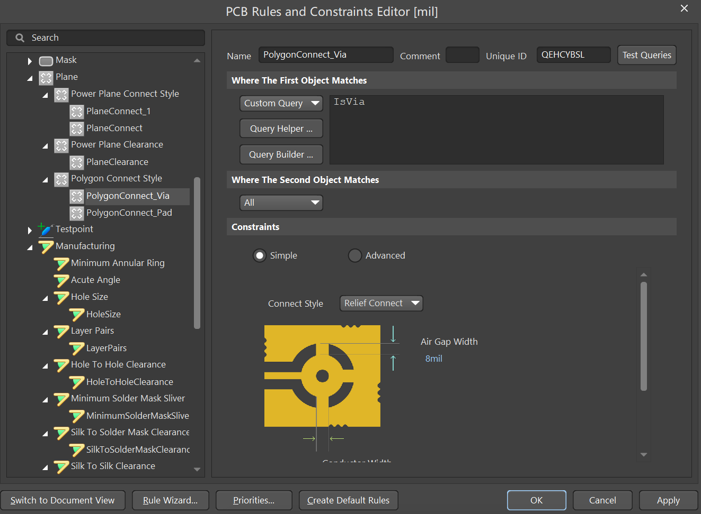
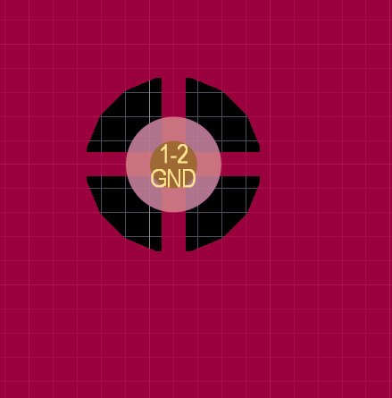
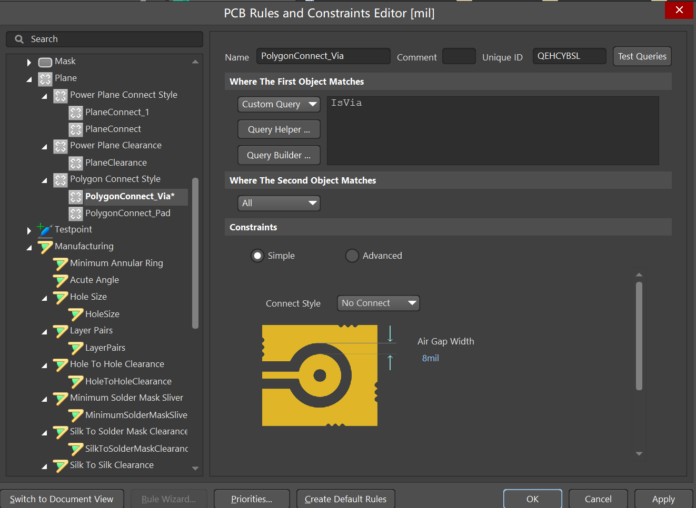
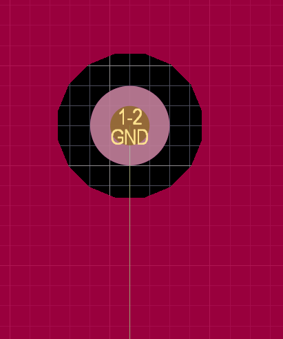
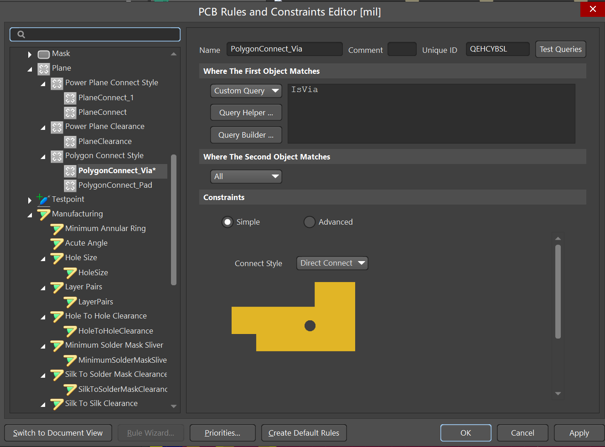
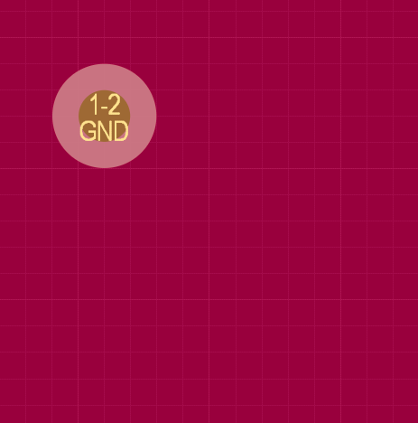
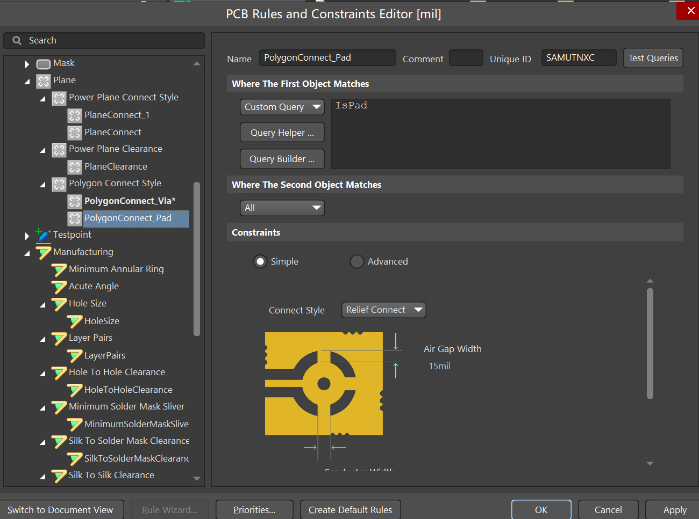
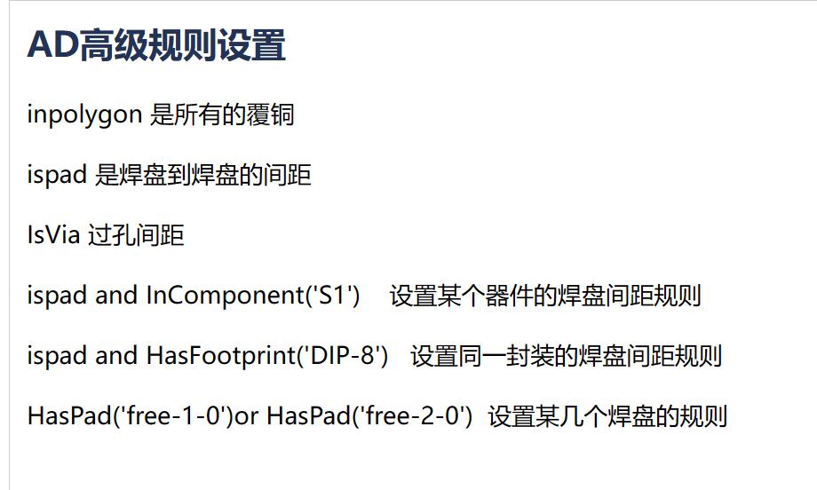

### PCB与覆铜过孔设置

##### 1、过孔与覆铜的连接方式

共有三种连接方式：不连接、十字连接和直连。一般我们会选择十字连接，选择这种的原因是：1、美观，2、拼板时可以通过过孔的形状判断PCB是否出错。

2、设置方法

在网上搜了很多方法，加上询问同事，总结方法如下：

打开Design--->Rules，找到Polygon Connect Style来进行设置。首先我们要知道什么是过孔和焊盘。可以这么理解，元器件的封装可以理解为焊盘，用于连接顶层底层的两种线为过孔。

过孔如下：

焊盘如下：

知道了什么是过孔，什么是焊盘，继续往下。

A、过孔十字方式设置

打开Design--->Rules，找到Polygon Connect Style，新建一个规则用于设置过孔，新建规则设置如下：

距离我这里写的8mil，大家可以根据需要自己设置，设置完成点击应用，然后OK，返回后重新覆铜，效果如下：

B过孔设置不连接

打开Design--->Rules，找到Polygon Connect Style，Connect Style选择NO connect，然后应用，返回在覆铜。

看一下效果如图：

C过孔设置直连

打开Design--->Rules，找到Polygon Connect Style，Connect Style选择Direct Connect，然后应用，返回在覆铜。

看下效果如图：

D焊盘与覆铜的设置方式

和过孔配置一致，注意在选择是针对焊盘，其他配置一致英文代表的意思截图放在后面啦。

