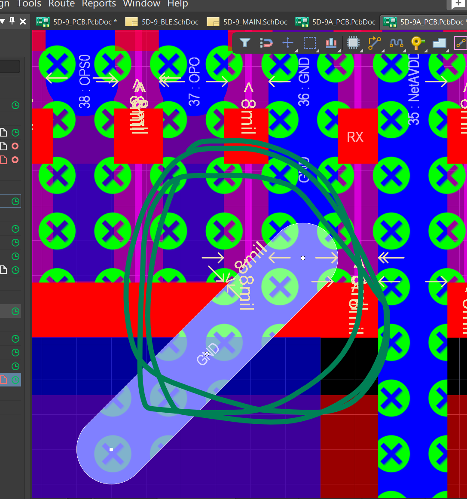
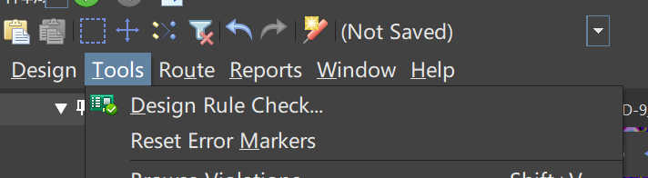
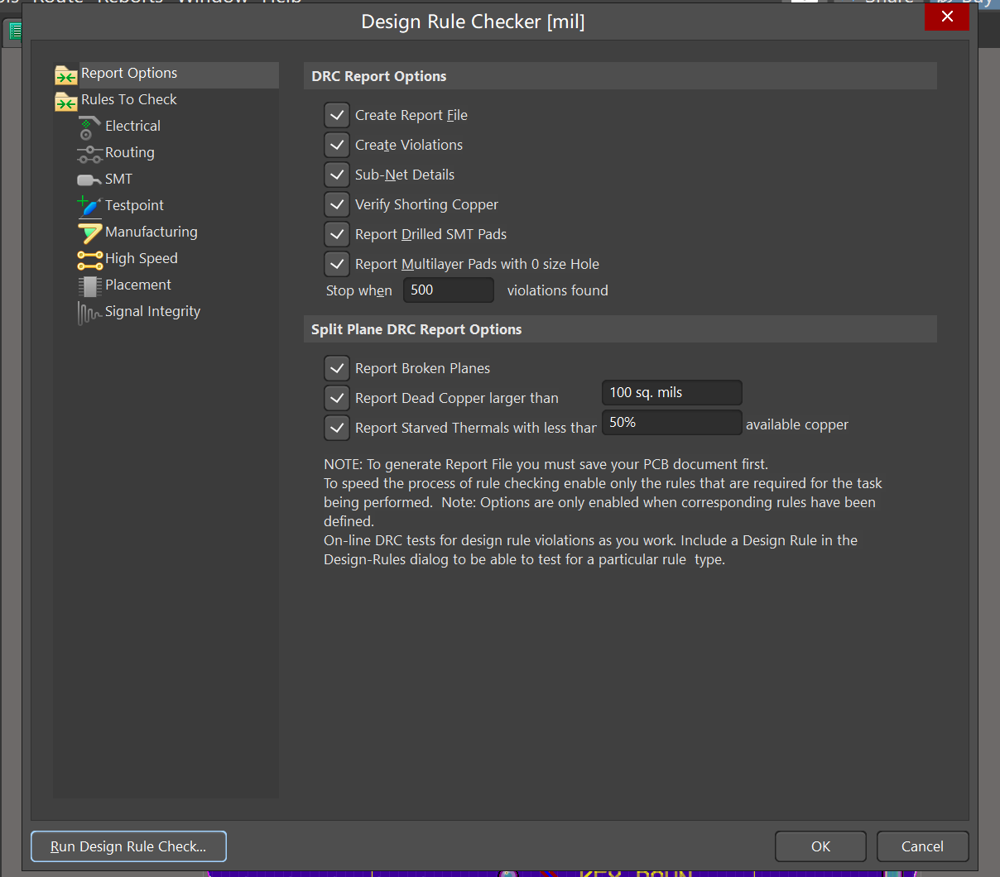
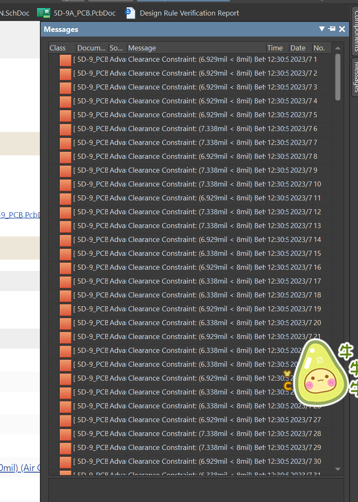
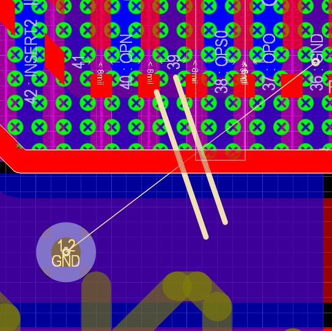
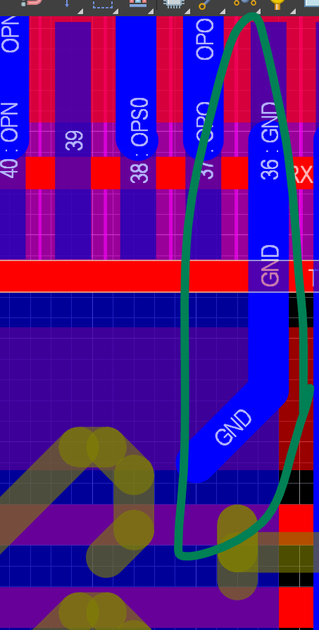
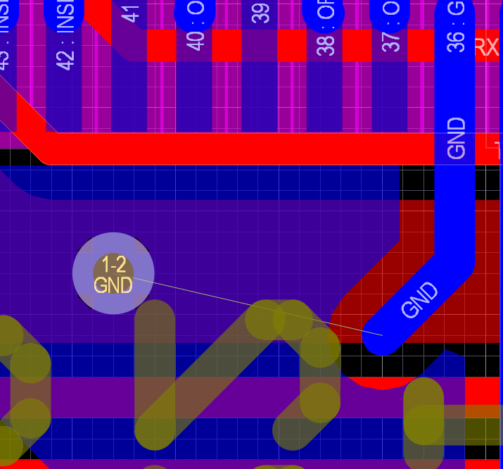

###  PCB制图线距报错

对板子进行测试，发现OPA电压不对，DAC输出电压没有问题，OPA接DAC输出应该和DAC电压大致差不多，但是电压差100mV。原因经查找是图中GND走线与旁边引脚OPO有接触。在未焊接任何元件的裸板进行测试，OPO引脚和GND的确导通。

走线在检查报错时一定要注意：线距小于8mil的一定要仔细查看，避免后续问题。

报错运行如下：

点击Tools  -->Design Rule Check 

出现以下界面，然后点击Run Design Rule Check 进行规则检查。

查看报错信息如下：注意下以下报错信息和PCB板子上是否有为连接的线。

报错信息如图：

PCB如果有线未连接如下显示：

另外，这种走线在PCB连线中是允许的，如下图。注意：这种线是线和覆铜相连，由于线GND和覆铜都是GND，所以可以连接，在画的时候要注意：线必须在覆铜上，线和覆铜才会导通。如图，这种走线是正确的。

如图，这样连接是不导通的：

覆铜避开了线，虽然它们都是GND，但是没有导通，这种走线是错误的。

