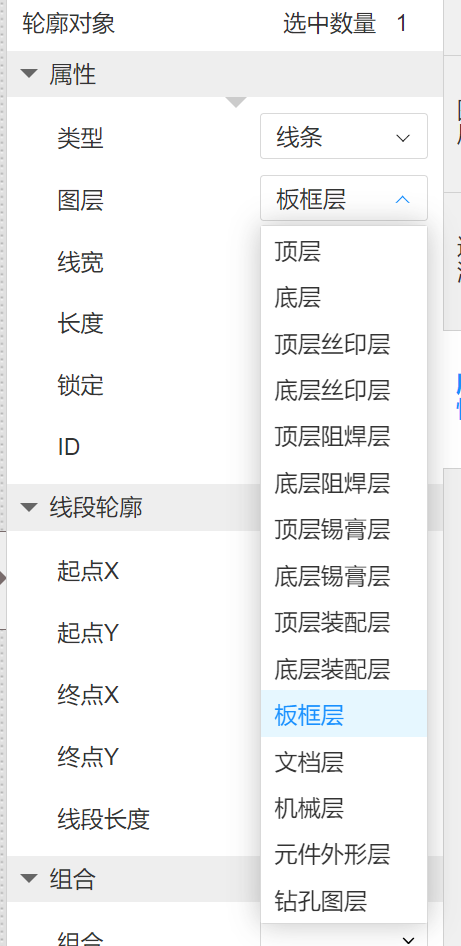

### 嘉立创专业版使用笔记

习惯使用AD软件来画板子，刚开始使用嘉立创EDA有些不习惯。由于AD软件需要破解，AD时常出现闪退问题，闪退时不能及时保存修改，AD软件在使用时也会被吐槽。嘉立创EDA是免费的，有自动保存功能，下单制板也很方便，所以有很多工程师会使用嘉立创EDA来画图，所以要学会使用嘉立创EDA。

##### 1、导入结构（板框）图

打开文件 -->导入-->DXF，把结构体导入到PCB中

导入完成后，选择外壳图，把它改为板框层，这就是PCB的形状了。

##### 2、PCB上设置孔槽（拧螺丝洞）

选择放置-->挖槽区域-->选择形状，然后在板子上勾画区域大小。

##### 3、元件封装库修改

EDA上有它本身的封装，但是如果在上面搜不到，我们可以修改它的封装，改成我们想要的大小尺寸。

找到原理图这个元件，点它，然后有详情信息，找到封装，点进去。

可以选择嘉立创EDA自带的封装库，如果没有，找到右侧检查封装尺寸，有个画笔，点进去修改封装。

在修改封装的界面可以修改大小尺寸了。

##### 4、不规则区域覆铜

相比于AD选择机械层，然后选择所选区域覆铜的方法，感觉EDA的不规则区域覆铜比较麻烦。

点击放置-->覆铜区域，选择多边形，然后就是围着板框层画区域，如果有圆弧的话更麻烦一点。

##### 5、覆铜更新

更新覆铜需要顶层底层都更新，分别选择顶层底层的铜，选择重新覆铜。

注意：每次布线后重新更新顶层底层覆铜！！！

##### 6、元器件封装镜像

选择元件封装，鼠标点击不动，按键盘Y。