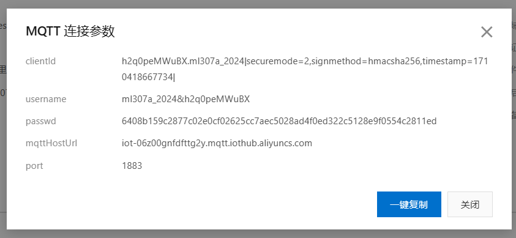
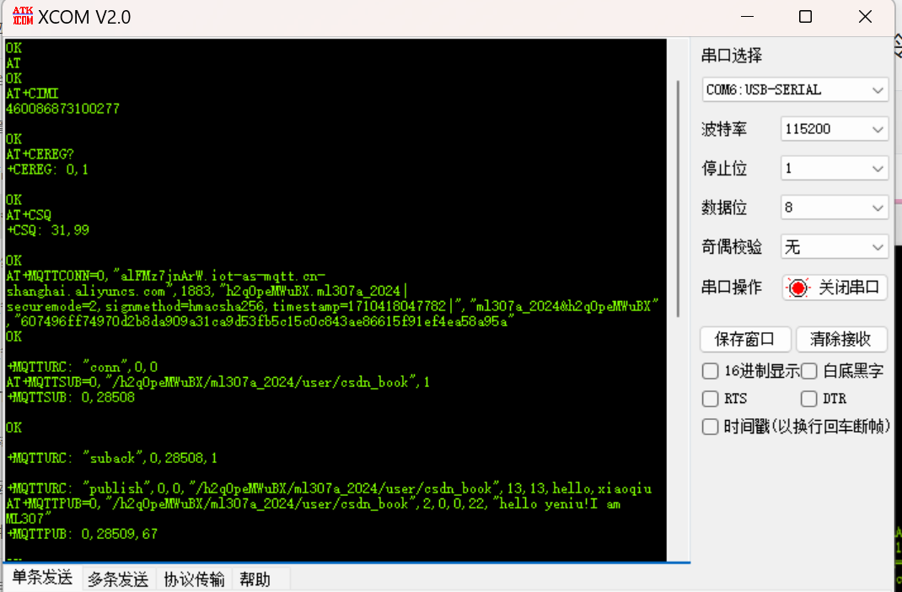

### ml307A连接阿里云

##### 1、需要的信息

MQTT连接参数、订阅或发布的主题、服务器地址、端口1883



服务器地址：      alFMz7jnArW.iot-as-mqtt.cn-shanghai.aliyuncs.com

##### 2、配置步骤

1、检测模块是否正常，发送“AT”，回复“OK”继续。

2、获取SIM卡的CIMI号，检测是否插卡及SIM卡是否正常，发送“AT+CIMI”，回复正常继续。

3、检查模块是否注网成功，发送“AT+CEREG?”，回复正常继续。

4、获取信号强度，发送“AT+CSQ”。

5、连接MQTT阿里云服务器指令如下，连接上继续。

```
AT+MQTTCONN=0,"alFMz7jnArW.iot-as-mqtt.cn-shanghai.aliyuncs.com",1883,"h2q0peMWuBX.ml307a_2024|securemode=2,signmethod=hmacsha256,timestamp=1710418047782|","ml307a_2024&h2q0peMWuBX","607496ff74970d2b8da909a31ca9d53fb5c15c0c843ae86615f91ef4ea58a95a"
```

6、订阅主题，指令如下

```
AT+MQTTSUB=0,"/h2q0peMWuBX/ml307a_2024/user/csdn_book",1

```

测试：在阿里云上发布消息，模块可以收到。

7、发送消息，指令如下

```
AT+MQTTPUB=0,"/h2q0peMWuBX/ml307a_2024/user/csdn_book",2,0,0,22,"hello yeniu!I am ML307"
```

测试：发送数据，阿里云可以收到

8、断开连接，指令如下

```
AT+MQTTDISC=0
```



发送ATE1串口显示发送数据
