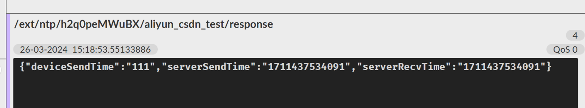
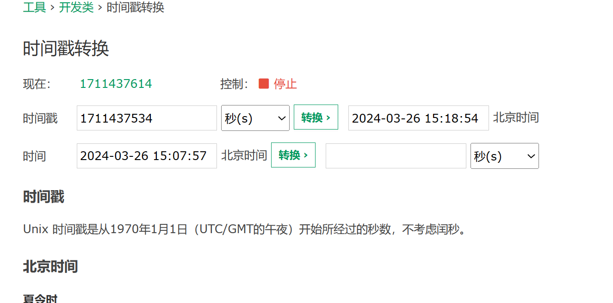

### 从云平台上获取准确的时间

需要两个topic


我们需要定于NTP时钟同步响应，向NTP时钟同步请求发条指令

发布指令：

```
/ext/ntp/h2q0peMWuBX/aliyun_csdn_test/request
```

消息

```
{deviceSendTime:"111"}
```

订阅topic

```
/ext/ntp/h2q0peMWuBX/aliyun_csdn_test/response
```

发送消息后，订阅的发来时间



1711437534091转化（需要去掉后三位）

[时间戳(Unix timestamp)转换工具 - 在线工具 (tool.lu)](https://tool.lu/timestamp/)

