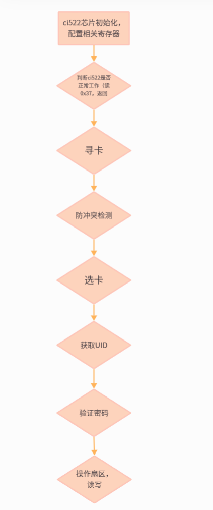

## NFC读卡

##### 1、NFC及卡片

NFC是近距离无线通讯技术，是一种非接触式识别和互联技术，可以在移动设备、消费类电子产品、PC和智能控件工具间进行近距离无线通信。NFC提供了一种简单、触控式的解决方案，可以让消费者简单直观地交换信息、访问内容与服务。

NFC模式：读卡器模式（刷标签）、仿真卡模式（刷手机）和点对点模式（传数据）。

卡片分为：IC卡、ID卡、M1卡和CPU卡，大多数情况使用M1卡。

###### M1卡数据结构：

M1卡有0~15共16个扇区，每个扇区配备了从0到3共四段，每段可以保存16字节的内容。要想读取对应扇区的数据，必须知道对应扇区的密码，有密码才能读数据。

本项目中，密码是0xFF。M1卡执行标准是ISO/IEC14443 Type A，读写频率是13.56MHz。

##### 2、卡片信息有哪些需要读取的，在什么位置

确定卡片重要信息所在扇区及位置。

##### 3、信息读取过程（怎么读？）

以一张普通白卡为例，我们用ci522测试下读卡写卡过程。读卡芯片市场上还是比较多的：ci522、rc522、si522等一堆。

读取过程简述如下：

ci522芯片初始化==>判断ci522是否正常工作（通过读取版本号）==>寻卡==>冲突检测==>选卡==>获取UID==>验证密码==>对扇区进行读写操作==>拿到扇区信息后，进行信息整合

##### 3、寻不到卡（怎么找原因？）

这个问题断断续续解决了快两周，周六日还在搞。正常情况下是可以寻到卡的，如果能够读到正确的版本号，但是还是寻不到卡，是不是ci522接收读卡电路出了问题，可以先用ci522开发板调试下，程序通了再画PCB。还有就是要相信自己，确认程序没问题就在PCB上找原因，千万不要死扣程序。

##### 4、单片机的设置

单片机SPI设置为主机模式，读卡前，控制ci522为正常工作状态，等待读卡。

