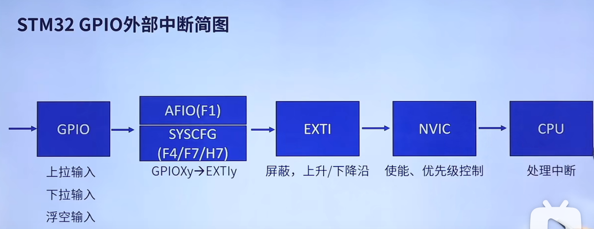
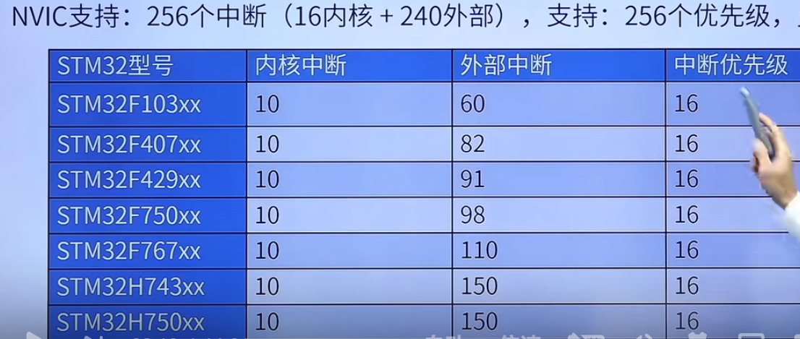
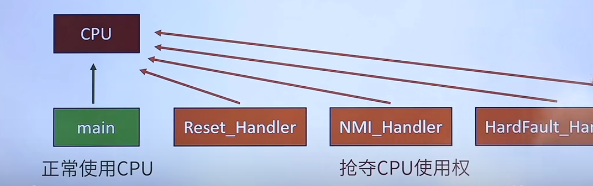
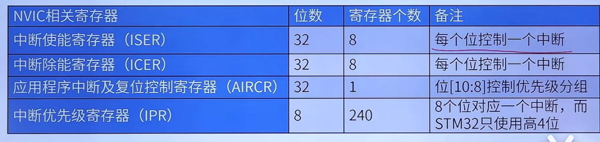
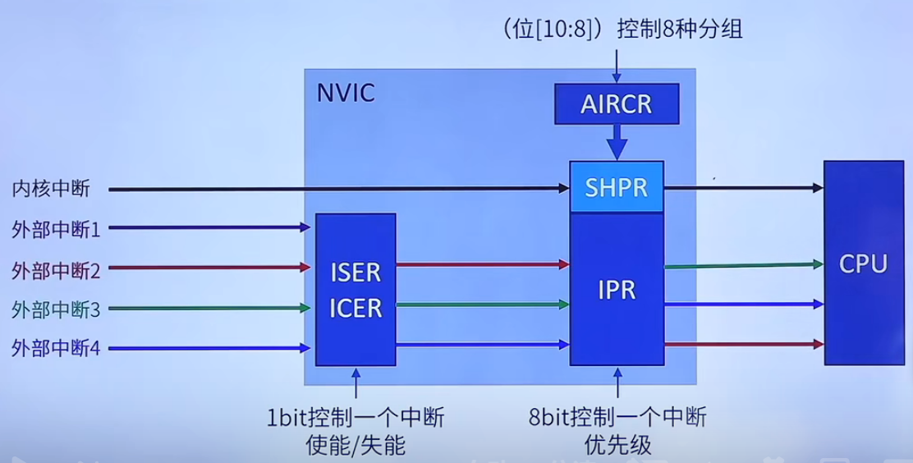
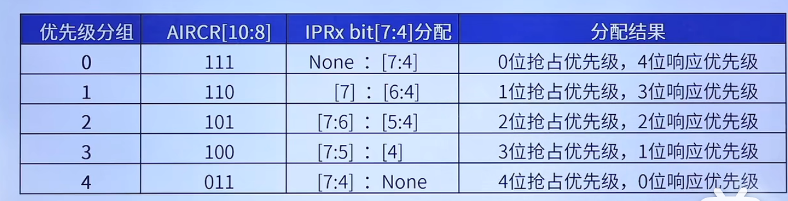
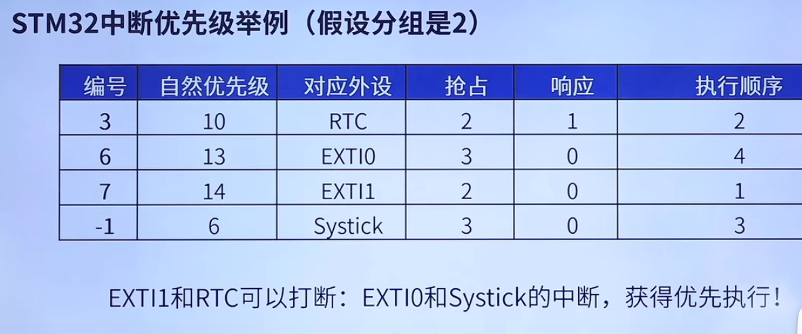
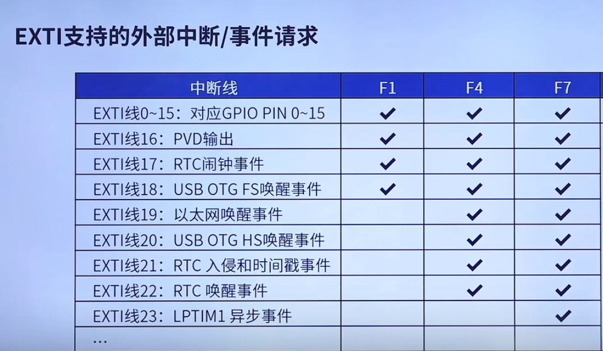
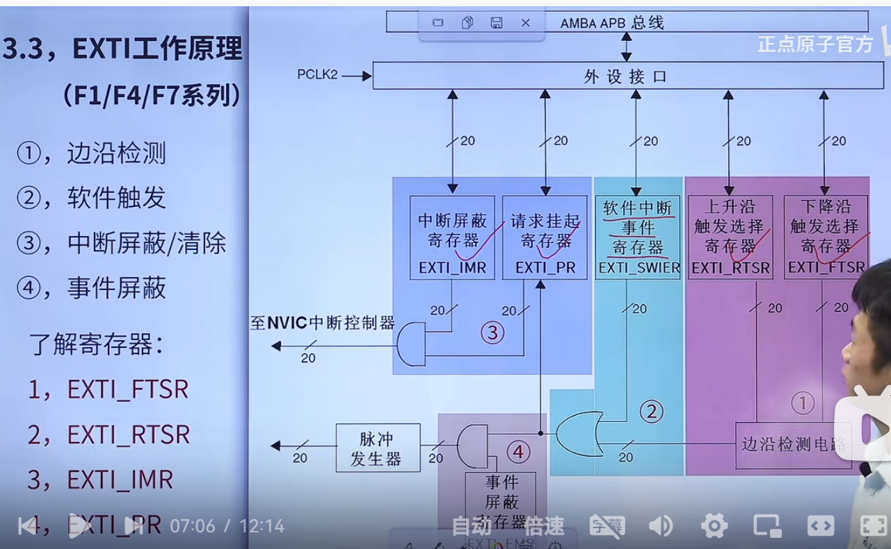

### 中断

##### 1、中断

打断CPU执行正常的程序，转而处理紧急的程序，然后返回原暂停的程序继续运行。

##### 2、中断作用

实时控制、故障处理、数据传输。

高效处理紧急程序，不会一直占用CPU资源。

##### 3、STM32  GPIO外部中断简图

### NVIC

##### 1、NVIC基本概念

NVIC，嵌入式向量中断控制器，属于内核。

支持：256个中断（内核+外部中断），256个优先级，允许剪裁。

中断服务函数------中断入口。

##### 2、中断向量表

定义一块固定的内存，以4字节对齐，存放各个中断服务函数程序的首地址。

中断向量表定义在启动文件，当中断发生，CPU会自动执行对应的中断服务函数。

##### 3、NVIC相关寄存器

##### 4、NVIC工作原理

##### 5、STM32中断优先级基本概念

1、抢占优先级：高抢占优先级可以打断正在执行的低优先级中断。

2、响应优先级：当抢占优先级相同，响应优先级高的先执行，但是不能互相打断。

3、抢占和响应相同的情况下，自然优先级高的，先执行。

4、自然优先级：中断向量表优先级。

5、数值越小，表示优先级越高。

##### 6、STM32中断优先级分组

一个工程中，一般只设置一次中断优先级分组。

举例：

如果分组为2（4抢占，4响应）

先考虑抢占优先级，再比较响应优先级，最后比较自然优先级

### EXTI

##### 1、介绍

EXTI，外部（扩展）中断事件控制器。

包含20个产生事件、中断请求的边沿检测器，：20条ETXT线。

中断和事件的理解：

中断：要进入NVIC,要有相应的中断服务函数，需要CPU处理。

事件：不进入NVIC，仅用于内部硬件自动控制的，如：TIM、DMA、ADC。

##### 2、特性

每条EXTI线都可以单独配置：选择类型（中断或者事件）、触发方式（上升沿，下降沿或者双边沿触发）、支持软件触发、开启/屏蔽、有挂起状态位。

##### 3、EXTI工作原理

边沿检测、软件触发、中断屏蔽/清除、事件屏蔽。

